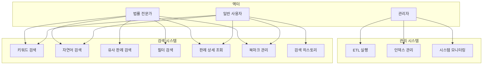

# 요구사항 분석

## 1. 개요

본 문서는 법률 판례 검색 시스템의 기능적/비기능적 요구사항을 정의합니다.

---

## 2. 이해관계자 분석

### 2.1 주요 이해관계자

| 이해관계자 | 역할 | 관심사 |
|------------|------|--------|
| 일반 사용자 | 법률 정보 검색 | 쉬운 검색, 정확한 결과 |
| 법률 전문가 | 판례 연구 | 상세 정보, 유사 판례 |
| 법학 학생 | 학습 및 연구 | 관련 판례 탐색 |
| 시스템 관리자 | 운영 및 유지보수 | 안정성, 모니터링 |

### 2.2 사용자 페르소나

#### 페르소나 1: 김변호사 (법률 전문가)
- **나이**: 35세
- **직업**: 개인 법무법인 소속 변호사
- **목표**: 담당 사건과 유사한 선례 판례 빠르게 검색
- **Pain Point**: 기존 검색 시스템에서 키워드 검색 결과가 너무 많음
- **니즈**: AI가 분석한 유사도 높은 판례 우선 제공

#### 페르소나 2: 이대학생 (법학 전공자)
- **나이**: 24세
- **직업**: 로스쿨 2학년
- **목표**: 특정 법리에 대한 판례 학습
- **Pain Point**: 법률 전문 용어를 잘 모름
- **니즈**: 일상 언어로 검색해도 관련 판례 찾기

#### 페르소나 3: 박시민 (일반 시민)
- **나이**: 42세
- **직업**: 회사원
- **목표**: 개인 분쟁에 참고할 판례 찾기
- **Pain Point**: 복잡한 법률 시스템에 익숙하지 않음
- **니즈**: 간단한 UI, 이해하기 쉬운 결과 표시

---

## 3. 기능 요구사항 (Functional Requirements)

### 3.1 데이터 수집 및 관리 (FR-ETL)

| ID | 요구사항 | 설명 |
|----|----------|------|
| FR-ETL-001 | 판례 데이터 수집 | 법제처 API를 통해 대법원 판례 수집 |
| FR-ETL-002 | 헌재결정례 수집 | 헌법재판소 결정례 수집 |
| FR-ETL-003 | 법령해석례 수집 | 법제처 법령해석례 수집 |
| FR-ETL-004 | 행정심판례 수집 | 행정심판례 수집 |
| FR-ETL-005 | 관련 법령 수집 | 판례에 연결된 법령 정보 수집 |
| FR-ETL-006 | 증분 업데이트 | 신규/변경 데이터만 선별 수집 |
| FR-ETL-007 | 데이터 정합성 검증 | 수집 데이터의 무결성 검증 |
| FR-ETL-008 | 수집 로그 관리 | ETL 수행 로그 기록 |

### 3.2 검색 기능 (FR-SEARCH)

| ID | 요구사항 | 설명 |
|----|----------|------|
| FR-SEARCH-001 | 키워드 검색 | 제목, 본문, 판시사항 내 키워드 검색 |
| FR-SEARCH-002 | 사건번호 검색 | 정확한 사건번호로 판례 조회 |
| FR-SEARCH-003 | 자연어 검색 | 일상 언어로 관련 판례 검색 |
| FR-SEARCH-004 | 유사 판례 검색 | 입력 텍스트 기반 유사도 높은 판례 검색 |
| FR-SEARCH-005 | 필터 검색 | 법원, 사건유형, 기간 등 필터링 |
| FR-SEARCH-006 | 복합 검색 | AND, OR, NOT 등 논리 연산자 지원 |
| FR-SEARCH-007 | 정렬 기능 | 관련도, 날짜, 인용수 등 정렬 |
| FR-SEARCH-008 | 페이지네이션 | 검색 결과 페이지 분할 |
| FR-SEARCH-009 | 검색어 자동완성 | 입력 중 검색어 추천 |
| FR-SEARCH-010 | 연관 검색어 제안 | 검색 결과 기반 연관 검색어 제안 |

### 3.3 판례 조회 기능 (FR-CASE)

| ID | 요구사항 | 설명 |
|----|----------|------|
| FR-CASE-001 | 판례 상세 조회 | 판례 전문 및 메타정보 표시 |
| FR-CASE-002 | 판시사항 표시 | 판시사항 구조화 표시 |
| FR-CASE-003 | 판결요지 표시 | 판결요지 구조화 표시 |
| FR-CASE-004 | 참조조문 표시 | 관련 법령 조문 연계 표시 |
| FR-CASE-005 | 참조판례 표시 | 해당 판례가 인용한 다른 판례 표시 |
| FR-CASE-006 | 유사 판례 표시 | AI 분석 유사 판례 목록 표시 |
| FR-CASE-007 | 판결결과 표시 | 원고/피고 승소 등 결과 표시 |
| FR-CASE-008 | 하이라이트 기능 | 주요 문장 하이라이트 |

### 3.4 사용자 기능 (FR-USER)

| ID | 요구사항 | 설명 |
|----|----------|------|
| FR-USER-001 | 북마크 저장 | 판례 북마크 기능 (로컬 스토리지) |
| FR-USER-002 | 검색 히스토리 | 검색 기록 저장 및 조회 |
| FR-USER-003 | 최근 본 판례 | 최근 조회 판례 목록 |

### 3.5 관리 기능 (FR-ADMIN)

| ID | 요구사항 | 설명 |
|----|----------|------|
| FR-ADMIN-001 | ETL 수동 실행 | 관리자 ETL 수동 트리거 |
| FR-ADMIN-002 | 인덱스 재생성 | 벡터 인덱스 재빌드 |
| FR-ADMIN-003 | 시스템 상태 조회 | DB, 인덱스, API 상태 확인 |
| FR-ADMIN-004 | 통계 대시보드 | 수집 현황, 검색 통계 등 |

---

## 4. 비기능 요구사항 (Non-Functional Requirements)

### 4.1 성능 요구사항 (NFR-PERF)

| ID | 요구사항 | 목표치 | 설명 |
|----|----------|--------|------|
| NFR-PERF-001 | 검색 응답 시간 | < 500ms | 95percentile 기준 |
| NFR-PERF-002 | 상세 조회 응답 시간 | < 300ms | 95percentile 기준 |
| NFR-PERF-003 | 유사도 검색 응답 시간 | < 1000ms | 95percentile 기준 |
| NFR-PERF-004 | 동시 접속자 처리 | 100명 | 동시 요청 처리 |
| NFR-PERF-005 | 일일 ETL 처리량 | 10,000건 | 일일 신규 데이터 처리 |

### 4.2 확장성 요구사항 (NFR-SCALE)

| ID | 요구사항 | 설명 |
|----|----------|------|
| NFR-SCALE-001 | 데이터 확장성 | 50만건 이상 판례 저장 가능 |
| NFR-SCALE-002 | 벡터 인덱스 확장 | 100만 벡터 이상 저장/검색 가능 |
| NFR-SCALE-003 | 모듈 확장성 | 새로운 데이터 소스 추가 용이 |

### 4.3 가용성 요구사항 (NFR-AVAIL)

| ID | 요구사항 | 목표치 | 설명 |
|----|----------|--------|------|
| NFR-AVAIL-001 | 서비스 가용률 | 99% | 연간 기준 |
| NFR-AVAIL-002 | 장애 복구 시간 | < 1시간 | MTTR |
| NFR-AVAIL-003 | 데이터 백업 | 일 1회 | 자동 백업 |

### 4.4 보안 요구사항 (NFR-SEC)

| ID | 요구사항 | 설명 |
|----|----------|------|
| NFR-SEC-001 | 입력 검증 | SQL Injection, XSS 방지 |
| NFR-SEC-002 | API 키 관리 | 법제처 API 키 안전 저장 |
| NFR-SEC-003 | 로깅 | 접근 로그, 오류 로그 기록 |
| NFR-SEC-004 | HTTPS | TLS 1.2 이상 적용 (배포 시) |

### 4.5 운영 요구사항 (NFR-OPS)

| ID | 요구사항 | 설명 |
|----|----------|------|
| NFR-OPS-001 | 로그 수집 | 구조화된 로그 (JSON 형식) |
| NFR-OPS-002 | 헬스체크 | /health 엔드포인트 제공 |
| NFR-OPS-003 | 설정 관리 | 환경 변수 기반 설정 |
| NFR-OPS-004 | 문서화 | API 문서 자동 생성 (OpenAPI) |

### 4.6 개발 요구사항 (NFR-DEV)

| ID | 요구사항 | 설명 |
|----|----------|------|
| NFR-DEV-001 | 코드 품질 | 린터, 포매터 적용 |
| NFR-DEV-002 | 테스트 커버리지 | 핵심 로직 70% 이상 |
| NFR-DEV-003 | 타입 힌트 | Python 타입 어노테이션 사용 |
| NFR-DEV-004 | 의존성 관리 | requirements.txt 또는 pyproject.toml |

---

## 5. 사용자 스토리 (User Stories)

### 5.1 검색 관련

```
US-001: 키워드 검색
As a 법률 전문가
I want to 특정 키워드로 판례를 검색하고 싶다
So that 관련 판례를 빠르게 찾을 수 있다

Acceptance Criteria:
- 검색어 입력 후 Enter 또는 검색 버튼 클릭으로 검색 실행
- 검색 결과가 관련도 순으로 정렬되어 표시
- 검색어가 결과에서 하이라이트 표시
- 검색 결과 없을 시 안내 메시지 표시
```

```
US-002: 자연어 검색
As a 일반 사용자
I want to 일상적인 표현으로 검색하고 싶다
So that 법률 전문 용어를 몰라도 관련 판례를 찾을 수 있다

Acceptance Criteria:
- "이웃집에서 나는 소음으로 피해를 입었을 때" 같은 자연어 검색 지원
- AI가 의미를 분석하여 관련 판례 추천
- 검색어와 결과의 연관성 점수 표시
```

```
US-003: 유사 판례 찾기
As a 변호사
I want to 내가 가진 사건과 유사한 판례를 찾고 싶다
So that 변론 준비에 참고할 수 있다

Acceptance Criteria:
- 텍스트 입력란에 사건 내용 붙여넣기 가능
- 입력 텍스트와 유사도 높은 판례 목록 표시
- 유사도 점수 시각적으로 표시 (예: 85%)
- 유사 판례 최대 20건 표시
```

```
US-004: 필터 검색
As a 법학 연구자
I want to 특정 조건으로 검색 결과를 필터링하고 싶다
So that 연구 범위에 맞는 판례만 볼 수 있다

Acceptance Criteria:
- 법원 (대법원, 고등법원 등) 필터
- 사건 유형 (민사, 형사, 행정 등) 필터
- 기간 (시작일 ~ 종료일) 필터
- 필터 조합 적용 가능
- 필터 초기화 기능
```

### 5.2 조회 관련

```
US-005: 판례 상세 조회
As a 사용자
I want to 판례의 상세 내용을 보고 싶다
So that 판례의 전문과 핵심 내용을 파악할 수 있다

Acceptance Criteria:
- 사건번호, 선고일, 법원 정보 표시
- 판시사항, 판결요지 구조화 표시
- 판결 전문 표시
- 참조조문, 참조판례 링크 연결
- 이전/다음 판례 네비게이션
```

```
US-006: 유사 판례 추천 확인
As a 사용자
I want to 현재 보고 있는 판례와 유사한 판례를 확인하고 싶다
So that 관련 판례를 추가로 탐색할 수 있다

Acceptance Criteria:
- 판례 상세 페이지에 유사 판례 섹션 표시
- 유사도 점수와 함께 표시
- 유사 판례 클릭 시 해당 판례로 이동
- 최소 5건, 최대 10건 표시
```

### 5.3 사용자 편의 기능

```
US-007: 판례 북마크
As a 사용자
I want to 관심 있는 판례를 저장해두고 싶다
So that 나중에 다시 쉽게 찾아볼 수 있다

Acceptance Criteria:
- 판례 상세 페이지에서 북마크 버튼 클릭
- 북마크된 판례는 아이콘으로 표시
- 북마크 목록 페이지에서 저장된 판례 확인
- 북마크 해제 기능
- 로컬 스토리지에 저장 (로그인 불필요)
```

```
US-008: 검색 히스토리
As a 사용자
I want to 이전 검색 기록을 확인하고 싶다
So that 같은 검색을 반복하지 않아도 된다

Acceptance Criteria:
- 최근 검색어 10개 자동 저장
- 검색창 클릭 시 히스토리 드롭다운 표시
- 히스토리 항목 클릭으로 재검색
- 개별/전체 히스토리 삭제 기능
```

---

## 6. 유스케이스 다이어그램



---

## 7. 요구사항 추적 매트릭스

| 요구사항 ID | 관련 유스케이스 | 구현 모듈 | 테스트 케이스 |
|-------------|----------------|-----------|---------------|
| FR-SEARCH-001 | US-001 | search_service.py | TC-SEARCH-001 |
| FR-SEARCH-003 | US-002 | embedding_service.py | TC-SEARCH-003 |
| FR-SEARCH-004 | US-003 | embedding_service.py | TC-SEARCH-004 |
| FR-SEARCH-005 | US-004 | search_service.py | TC-SEARCH-005 |
| FR-CASE-001 | US-005 | case_service.py | TC-CASE-001 |
| FR-CASE-006 | US-006 | embedding_service.py | TC-CASE-006 |
| FR-USER-001 | US-007 | (Frontend) | TC-USER-001 |
| FR-USER-002 | US-008 | (Frontend) | TC-USER-002 |

---

## 8. 제약사항

### 8.1 기술적 제약
- Python 3.10 이상 필수
- 법제처 OpenAPI 인증키 필요 (무료)
- FAISS는 CPU 버전만 사용 (GPU 미사용)
- 메모리 최소 8GB 권장 (임베딩 모델 로딩)

### 8.2 법적 제약
- 법제처 데이터 이용 약관 준수
- 상업적 이용 시 법제처 정책 확인 필요
- 개인정보 포함 데이터 처리 주의

### 8.3 운영 제약
- 클라우드 서비스 미사용 (비용 제약)
- Docker/Kubernetes 미사용
- Elasticsearch 미사용

---

## 9. 가정 및 의존성

### 9.1 가정
- 법제처 OpenAPI가 안정적으로 운영됨
- 수집 대상 판례 데이터가 XML/JSON 형식으로 제공됨
- 사용자는 현대적인 웹 브라우저 사용

### 9.2 의존성
- 법제처 OpenAPI 가용성
- Hugging Face 모델 다운로드 가능
- Python 패키지 저장소(PyPI) 접근 가능
