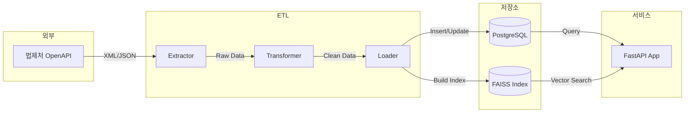

# 데이터 정의

## 1. 개요

본 문서는 시스템에서 수집, 저장, 처리하는 데이터의 구조와 필드를 정의합니다.

---

## 2. 데이터 소스

### 2.1 법제처 OpenAPI 데이터

| 데이터 유형 | API 유형 | 설명 |
|------------|----------|------|
| 판례 | 판례 목록/본문 | 대법원, 고등법원 등 판례 |
| 헌재결정례 | 헌재결정례 목록/본문 | 헌법재판소 결정 |
| 법령해석례 | 법령해석례 목록/본문 | 법제처 유권해석 |
| 행정심판례 | 행정심판례 목록/본문 | 행정심판위원회 재결 |
| 법령 | 법령 목록/본문 | 참조 법령 정보 |
| 법령용어 | 법령용어 조회 | 법률 용어 정의 |

---

## 3. 판례 데이터 정의

### 3.1 판례 목록 응답 필드 (법제처 API)

```xml
<PrecSearch>
    <totalCnt>12345</totalCnt>         <!-- 전체 건수 -->
    <page>1</page>                      <!-- 현재 페이지 -->
    <prec>
        <판례일련번호>123456</판례일련번호>
        <사건명>손해배상(기)</사건명>
        <사건번호>2023다12345</사건번호>
        <선고일자>20231215</선고일자>
        <선고>선고</선고>
        <법원명>대법원</법원명>
        <법원종류코드>400201</법원종류코드>
        <사건종류명>민사</사건종류명>
        <사건종류코드>400101</사건종류코드>
        <판결유형>판결</판결유형>
        <판시사항>판시사항 내용...</판시사항>
        <판결요지>판결요지 내용...</판결요지>
        <참조조문>민법 제750조...</참조조문>
        <참조판례>대법원 2020.1.1. 선고 2019다12345 판결</참조판례>
    </prec>
</PrecSearch>
```

### 3.2 판례 본문 응답 필드 (법제처 API)

```xml
<PrecService>
    <판례정보일련번호>123456</판례정보일련번호>
    <사건명>손해배상(기)</사건명>
    <사건번호>2023다12345</사건번호>
    <선고일자>20231215</선고일자>
    <선고>선고</선고>
    <법원명>대법원</법원명>
    <법원종류코드>400201</법원종류코드>
    <사건종류명>민사</사건종류명>
    <사건종류코드>400101</사건종류코드>
    <판결유형>판결</판결유형>
    <판시사항>
        [1] 불법행위로 인한 손해배상청구에서...
        [2] 위자료 산정 기준...
    </판시사항>
    <판결요지>
        [1] 불법행위로 인한 손해배상책임이 성립하려면...
        [2] 위자료는 피해자의 나이, 직업...
    </판결요지>
    <참조조문>
        민법 제750조(불법행위의 내용)
        민법 제751조(재산 이외의 손해의 배상)
    </참조조문>
    <참조판례>
        대법원 2020. 1. 1. 선고 2019다12345 판결(공2020상, 123)
    </참조판례>
    <판례내용>
        【원고, 피상고인】 원고 (소송대리인 변호사 ○○○)
        【피고, 상고인】 피고 (소송대리인 법무법인 △△△ 담당변호사 □□□)
        【원심판결】 서울고등법원 2023. 10. 1. 선고 2023나12345 판결
        【주문】
        상고를 기각한다.
        상고비용은 피고가 부담한다.
        【이유】
        상고이유를 판단한다.
        1. 불법행위의 성립에 관하여...
        (이하 생략)
    </판례내용>
</PrecService>
```

### 3.3 내부 판례 데이터 모델

```python
class Case:
    """판례 데이터 모델"""
    
    # 기본 정보
    id: int                          # 내부 ID (PK)
    serial_number: str               # 판례일련번호 (법제처 원본 ID)
    case_name: str                   # 사건명
    case_number: str                 # 사건번호 (예: 2023다12345)
    
    # 재판 정보
    decision_date: date              # 선고일자
    decision_type: str               # 선고 유형 (선고, 결정 등)
    court_name: str                  # 법원명
    court_code: str                  # 법원종류코드
    case_type: str                   # 사건종류명 (민사, 형사 등)
    case_type_code: str              # 사건종류코드
    judgment_type: str               # 판결유형 (판결, 결정, 명령 등)
    
    # 내용
    holding: str                     # 판시사항
    summary: str                     # 판결요지
    full_text: str                   # 판례내용 (전문)
    
    # 참조 정보
    reference_articles: str          # 참조조문 (원본 텍스트)
    reference_cases: str             # 참조판례 (원본 텍스트)
    
    # 메타데이터
    created_at: datetime             # 수집 일시
    updated_at: datetime             # 수정 일시
    source_url: str                  # 원본 URL
    
    # 검색/분석용
    search_text: str                 # 검색용 통합 텍스트
    embedding_id: int                # 벡터 인덱스 ID (FK)
```

### 3.4 판례 필드 상세 설명

| 필드명 | 타입 | 길이 | NULL | 설명 |
|--------|------|------|------|------|
| id | INTEGER | - | NOT NULL | 자동 증가 PK |
| serial_number | VARCHAR | 20 | NOT NULL | 법제처 판례일련번호 (UNIQUE) |
| case_name | VARCHAR | 200 | NOT NULL | 사건명 |
| case_number | VARCHAR | 50 | NOT NULL | 사건번호 |
| decision_date | DATE | - | NOT NULL | 선고일자 |
| decision_type | VARCHAR | 20 | NULL | 선고, 결정 등 |
| court_name | VARCHAR | 50 | NOT NULL | 법원명 |
| court_code | VARCHAR | 10 | NULL | 법원종류코드 |
| case_type | VARCHAR | 50 | NOT NULL | 사건종류 |
| case_type_code | VARCHAR | 10 | NULL | 사건종류코드 |
| judgment_type | VARCHAR | 20 | NULL | 판결, 결정, 명령 등 |
| holding | TEXT | - | NULL | 판시사항 |
| summary | TEXT | - | NULL | 판결요지 |
| full_text | TEXT | - | NULL | 판례내용 전문 |
| reference_articles | TEXT | - | NULL | 참조조문 |
| reference_cases | TEXT | - | NULL | 참조판례 |
| search_text | TEXT | - | NULL | 검색용 통합 텍스트 |
| created_at | TIMESTAMP | - | NOT NULL | 생성일시 |
| updated_at | TIMESTAMP | - | NOT NULL | 수정일시 |
| source_url | VARCHAR | 500 | NULL | 원본 URL |

---

## 4. 헌재결정례 데이터 정의

### 4.1 헌재결정례 필드

```python
class ConstitutionalDecision:
    """헌법재판소 결정례 데이터 모델"""
    
    id: int                          # 내부 ID (PK)
    serial_number: str               # 결정례일련번호
    case_name: str                   # 사건명
    case_number: str                 # 사건번호 (예: 2023헌바123)
    
    decision_date: date              # 결정일자
    decision_type: str               # 결정유형 (위헌, 합헌, 헌법불합치 등)
    case_type: str                   # 사건유형 (위헌법률심판, 헌법소원 등)
    
    holding: str                     # 결정요지
    full_text: str                   # 결정문 전문
    
    reference_articles: str          # 참조조문
    reference_decisions: str         # 참조결정
    
    created_at: datetime
    updated_at: datetime
```

### 4.2 헌재결정례 필드 상세

| 필드명 | 타입 | NULL | 설명 |
|--------|------|------|------|
| id | INTEGER | NOT NULL | PK |
| serial_number | VARCHAR(20) | NOT NULL | 법제처 일련번호 (UNIQUE) |
| case_name | VARCHAR(200) | NOT NULL | 사건명 |
| case_number | VARCHAR(50) | NOT NULL | 사건번호 |
| decision_date | DATE | NOT NULL | 결정일자 |
| decision_type | VARCHAR(50) | NULL | 위헌/합헌/헌법불합치 등 |
| case_type | VARCHAR(50) | NOT NULL | 사건유형 |
| holding | TEXT | NULL | 결정요지 |
| full_text | TEXT | NULL | 결정문 전문 |
| reference_articles | TEXT | NULL | 참조조문 |
| reference_decisions | TEXT | NULL | 참조결정 |
| created_at | TIMESTAMP | NOT NULL | 생성일시 |
| updated_at | TIMESTAMP | NOT NULL | 수정일시 |

---

## 5. 법령해석례 데이터 정의

### 5.1 법령해석례 필드

```python
class LegalInterpretation:
    """법령해석례 데이터 모델"""
    
    id: int                          # 내부 ID (PK)
    serial_number: str               # 해석례일련번호
    title: str                       # 제목
    interpretation_number: str       # 해석례 번호
    
    decision_date: date              # 회답일자
    requesting_agency: str           # 질의기관
    
    question: str                    # 질의요지
    answer: str                      # 회답
    reasoning: str                   # 이유
    
    reference_articles: str          # 관계법령
    
    created_at: datetime
    updated_at: datetime
```

---

## 6. 법령 데이터 정의

### 6.1 법령 필드 (참조용)

```python
class Law:
    """법령 데이터 모델 (참조용)"""
    
    id: int                          # 내부 ID (PK)
    mst_seq: str                     # 법령MST (법제처 ID)
    law_name: str                    # 법령명
    law_name_hangul: str             # 법령명(한글)
    law_type: str                    # 법령종류 (법률, 시행령 등)
    
    proclamation_date: date          # 공포일자
    proclamation_number: str         # 공포번호
    enforcement_date: date           # 시행일자
    
    department: str                  # 소관부처
    
    created_at: datetime
    updated_at: datetime
```

---

## 7. 임베딩 데이터 정의

### 7.1 벡터 임베딩 필드

```python
class CaseEmbedding:
    """판례 임베딩 데이터 모델"""
    
    id: int                          # 내부 ID (PK)
    case_id: int                     # 판례 ID (FK)
    
    embedding_model: str             # 사용 모델명
    embedding_version: str           # 모델 버전
    
    # 임베딩 벡터는 FAISS에 저장, 여기는 메타데이터만
    faiss_index_id: int              # FAISS 인덱스 내 ID
    
    source_text: str                 # 임베딩 원본 텍스트 (일부)
    text_type: str                   # 텍스트 유형 (summary, holding, full_text)
    
    created_at: datetime
    updated_at: datetime
```

### 7.2 임베딩 메타데이터 테이블

| 필드명 | 타입 | NULL | 설명 |
|--------|------|------|------|
| id | INTEGER | NOT NULL | PK |
| case_id | INTEGER | NOT NULL | 판례 ID (FK) |
| embedding_model | VARCHAR(100) | NOT NULL | 모델명 |
| embedding_version | VARCHAR(20) | NOT NULL | 모델 버전 |
| faiss_index_id | INTEGER | NOT NULL | FAISS 인덱스 ID |
| source_text | TEXT | NULL | 원본 텍스트 (truncated) |
| text_type | VARCHAR(20) | NOT NULL | summary/holding/full_text |
| created_at | TIMESTAMP | NOT NULL | 생성일시 |
| updated_at | TIMESTAMP | NOT NULL | 수정일시 |

---

## 8. ETL 로그 데이터 정의

### 8.1 ETL 작업 로그

```python
class ETLJobLog:
    """ETL 작업 로그"""
    
    id: int
    job_name: str                    # 작업명 (case_sync, embedding_build 등)
    job_type: str                    # full, incremental
    
    started_at: datetime             # 시작 시간
    finished_at: datetime            # 종료 시간
    
    status: str                      # success, failed, running
    total_count: int                 # 전체 처리 건수
    success_count: int               # 성공 건수
    fail_count: int                  # 실패 건수
    
    error_message: str               # 오류 메시지
    
    created_at: datetime
```

### 8.2 ETL 로그 필드

| 필드명 | 타입 | NULL | 설명 |
|--------|------|------|------|
| id | INTEGER | NOT NULL | PK |
| job_name | VARCHAR(50) | NOT NULL | 작업명 |
| job_type | VARCHAR(20) | NOT NULL | full/incremental |
| started_at | TIMESTAMP | NOT NULL | 시작 시간 |
| finished_at | TIMESTAMP | NULL | 종료 시간 |
| status | VARCHAR(20) | NOT NULL | 상태 |
| total_count | INTEGER | NULL | 전체 건수 |
| success_count | INTEGER | NULL | 성공 건수 |
| fail_count | INTEGER | NULL | 실패 건수 |
| error_message | TEXT | NULL | 오류 메시지 |
| created_at | TIMESTAMP | NOT NULL | 생성일시 |

---

## 9. 코드 테이블 정의

### 9.1 법원 종류 코드

| 코드 | 법원명 |
|------|--------|
| 400201 | 대법원 |
| 400202 | 고등법원 |
| 400203 | 특허법원 |
| 400204 | 지방법원 |
| 400205 | 가정법원 |
| 400206 | 행정법원 |
| 400207 | 회생법원 |

### 9.2 사건 종류 코드

| 코드 | 사건종류 |
|------|----------|
| 400101 | 민사 |
| 400102 | 형사 |
| 400103 | 행정 |
| 400104 | 가사 |
| 400105 | 특허 |
| 400106 | 세무 |

### 9.3 판결 유형 코드

| 코드 | 판결유형 |
|------|----------|
| JUDGMT | 판결 |
| RULING | 결정 |
| ORDER | 명령 |

---

## 10. 데이터 흐름도



---

## 11. 데이터 품질 규칙

### 11.1 필수 값 검증

| 엔티티 | 필수 필드 |
|--------|-----------|
| Case | serial_number, case_name, case_number, decision_date, court_name |
| ConstitutionalDecision | serial_number, case_number, decision_date |
| LegalInterpretation | serial_number, title, decision_date |

### 11.2 형식 검증

| 필드 | 형식 규칙 |
|------|-----------|
| case_number | `^\\d{4}[가-힣]+\\d+$` (예: 2023다12345) |
| decision_date | YYYYMMDD 또는 YYYY-MM-DD |
| serial_number | 숫자만 허용 |

### 11.3 중복 검증

- `serial_number`는 데이터 소스별로 유일해야 함
- 동일 `serial_number`로 재수집 시 업데이트 처리

---

## 12. 데이터 용량 추정

### 12.1 판례 데이터

| 항목 | 추정치 |
|------|--------|
| 대법원 판례 | ~50,000건 |
| 하급심 판례 | ~200,000건 |
| 평균 레코드 크기 | ~50KB |
| 총 DB 용량 | ~12GB |

### 12.2 벡터 데이터

| 항목 | 추정치 |
|------|--------|
| 벡터 차원 | 768 |
| 판례당 벡터 수 | 1~3개 |
| 벡터당 크기 | 3KB (768 * 4 bytes) |
| 총 벡터 수 | ~500,000개 |
| FAISS 인덱스 크기 | ~1.5GB |
