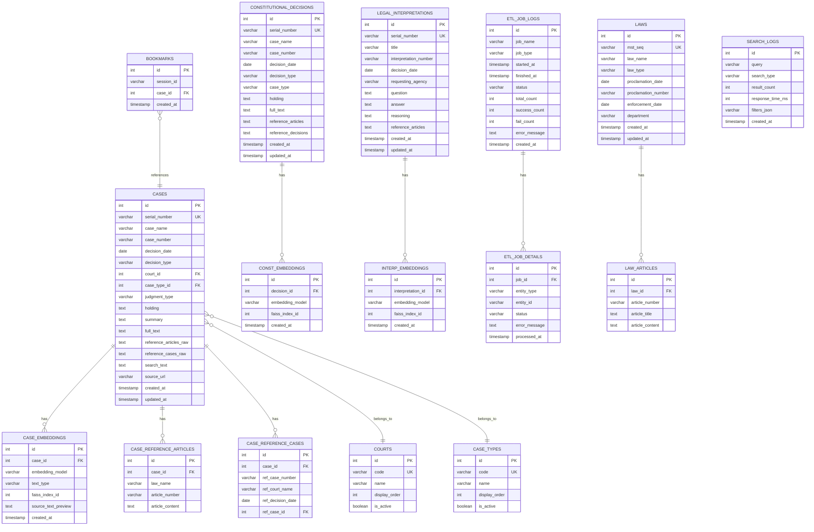

# ERD (Entity Relationship Diagram)

## 1. 개요

본 문서는 법률 판례 검색 시스템의 데이터베이스 스키마 설계입니다.

### 1.1 데이터베이스

- **DBMS**: PostgreSQL 15+ (권장) 또는 SQLite 3
- **인코딩**: UTF-8
- **타임존**: Asia/Seoul (KST)

---

## 2. ERD 다이어그램



---

## 3. 테이블 상세 정의

### 3.1 CASES (판례)

판례 데이터를 저장하는 핵심 테이블입니다.

```sql
CREATE TABLE cases (
    id SERIAL PRIMARY KEY,
    serial_number VARCHAR(20) NOT NULL UNIQUE,
    case_name VARCHAR(200) NOT NULL,
    case_number VARCHAR(50) NOT NULL,
    decision_date DATE NOT NULL,
    decision_type VARCHAR(20),
    court_id INTEGER REFERENCES courts(id),
    case_type_id INTEGER REFERENCES case_types(id),
    judgment_type VARCHAR(20),
    holding TEXT,
    summary TEXT,
    full_text TEXT,
    reference_articles_raw TEXT,
    reference_cases_raw TEXT,
    search_text TEXT,
    source_url VARCHAR(500),
    created_at TIMESTAMP WITH TIME ZONE DEFAULT CURRENT_TIMESTAMP,
    updated_at TIMESTAMP WITH TIME ZONE DEFAULT CURRENT_TIMESTAMP
);

-- 인덱스
CREATE INDEX idx_cases_serial_number ON cases(serial_number);
CREATE INDEX idx_cases_case_number ON cases(case_number);
CREATE INDEX idx_cases_decision_date ON cases(decision_date DESC);
CREATE INDEX idx_cases_court_id ON cases(court_id);
CREATE INDEX idx_cases_case_type_id ON cases(case_type_id);
CREATE INDEX idx_cases_search_text ON cases USING gin(to_tsvector('simple', search_text));

-- 트리거: updated_at 자동 갱신
CREATE OR REPLACE FUNCTION update_updated_at_column()
RETURNS TRIGGER AS $$
BEGIN
    NEW.updated_at = CURRENT_TIMESTAMP;
    RETURN NEW;
END;
$$ language 'plpgsql';

CREATE TRIGGER update_cases_updated_at
    BEFORE UPDATE ON cases
    FOR EACH ROW EXECUTE FUNCTION update_updated_at_column();
```

#### 컬럼 설명

| 컬럼명 | 타입 | NULL | 기본값 | 설명 |
|--------|------|------|--------|------|
| id | SERIAL | NOT NULL | auto | Auto increment PK |
| serial_number | VARCHAR(20) | NOT NULL | - | Law office case serial number (UK) |
| case_name | VARCHAR(200) | NOT NULL | - | Case name |
| case_number | VARCHAR(50) | NOT NULL | - | Case number |
| decision_date | DATE | NOT NULL | - | Decision date |
| decision_type | VARCHAR(20) | NULL | - | Decision/ruling type |
| court_id | INTEGER | NULL | - | Court FK |
| case_type_id | INTEGER | NULL | - | Case type FK |
| judgment_type | VARCHAR(20) | NULL | - | Judgment/decision/order type |
| holding | TEXT | NULL | - | Court holding |
| summary | TEXT | NULL | - | Judgment summary |
| full_text | TEXT | NULL | - | Full case text |
| reference_articles_raw | TEXT | NULL | - | Reference articles raw text |
| reference_cases_raw | TEXT | NULL | - | Reference cases raw text |
| search_text | TEXT | NULL | - | Integrated search text |
| source_url | VARCHAR(500) | NULL | - | Source URL |
| created_at | TIMESTAMP | NOT NULL | now() | Created datetime |
| updated_at | TIMESTAMP | NOT NULL | now() | Updated datetime |

---

### 3.2 CASE_EMBEDDINGS (판례 임베딩 메타데이터)

```sql
CREATE TABLE case_embeddings (
    id SERIAL PRIMARY KEY,
    case_id INTEGER NOT NULL REFERENCES cases(id) ON DELETE CASCADE,
    embedding_model VARCHAR(100) NOT NULL,
    text_type VARCHAR(20) NOT NULL,  -- 'summary', 'holding', 'full_text'
    faiss_index_id INTEGER NOT NULL,
    source_text_preview TEXT,  -- 처음 500자
    created_at TIMESTAMP WITH TIME ZONE DEFAULT CURRENT_TIMESTAMP
);

CREATE INDEX idx_case_embeddings_case_id ON case_embeddings(case_id);
CREATE INDEX idx_case_embeddings_faiss_id ON case_embeddings(faiss_index_id);
CREATE UNIQUE INDEX idx_case_embeddings_unique ON case_embeddings(case_id, embedding_model, text_type);
```

---

### 3.3 COURTS (법원)

```sql
CREATE TABLE courts (
    id SERIAL PRIMARY KEY,
    code VARCHAR(10) NOT NULL UNIQUE,
    name VARCHAR(50) NOT NULL,
    display_order INTEGER DEFAULT 0,
    is_active BOOLEAN DEFAULT TRUE
);

-- 초기 데이터
INSERT INTO courts (code, name, display_order) VALUES
    ('400201', '대법원', 1),
    ('400202', '고등법원', 2),
    ('400203', '특허법원', 3),
    ('400204', '지방법원', 4),
    ('400205', '가정법원', 5),
    ('400206', '행정법원', 6),
    ('400207', '회생법원', 7);
```

---

### 3.4 CASE_TYPES (사건유형)

```sql
CREATE TABLE case_types (
    id SERIAL PRIMARY KEY,
    code VARCHAR(10) NOT NULL UNIQUE,
    name VARCHAR(50) NOT NULL,
    display_order INTEGER DEFAULT 0,
    is_active BOOLEAN DEFAULT TRUE
);

-- 초기 데이터
INSERT INTO case_types (code, name, display_order) VALUES
    ('400101', '민사', 1),
    ('400102', '형사', 2),
    ('400103', '행정', 3),
    ('400104', '가사', 4),
    ('400105', '특허', 5),
    ('400106', '세무', 6);
```

---

### 3.5 CASE_REFERENCE_ARTICLES (참조조문)

```sql
CREATE TABLE case_reference_articles (
    id SERIAL PRIMARY KEY,
    case_id INTEGER NOT NULL REFERENCES cases(id) ON DELETE CASCADE,
    law_name VARCHAR(200) NOT NULL,
    article_number VARCHAR(50),
    article_content TEXT
);

CREATE INDEX idx_case_ref_articles_case_id ON case_reference_articles(case_id);
CREATE INDEX idx_case_ref_articles_law_name ON case_reference_articles(law_name);
```

---

### 3.6 CASE_REFERENCE_CASES (참조판례)

```sql
CREATE TABLE case_reference_cases (
    id SERIAL PRIMARY KEY,
    case_id INTEGER NOT NULL REFERENCES cases(id) ON DELETE CASCADE,
    ref_case_number VARCHAR(50) NOT NULL,
    ref_court_name VARCHAR(50),
    ref_decision_date DATE,
    ref_case_id INTEGER REFERENCES cases(id)  -- 내부 연결 (있을 경우)
);

CREATE INDEX idx_case_ref_cases_case_id ON case_reference_cases(case_id);
CREATE INDEX idx_case_ref_cases_ref_number ON case_reference_cases(ref_case_number);
```

---

### 3.7 CONSTITUTIONAL_DECISIONS (헌재결정례)

```sql
CREATE TABLE constitutional_decisions (
    id SERIAL PRIMARY KEY,
    serial_number VARCHAR(20) NOT NULL UNIQUE,
    case_name VARCHAR(200) NOT NULL,
    case_number VARCHAR(50) NOT NULL,
    decision_date DATE NOT NULL,
    decision_type VARCHAR(50),  -- 위헌, 합헌, 헌법불합치 등
    case_type VARCHAR(50),  -- 위헌법률심판, 헌법소원 등
    holding TEXT,
    full_text TEXT,
    reference_articles TEXT,
    reference_decisions TEXT,
    created_at TIMESTAMP WITH TIME ZONE DEFAULT CURRENT_TIMESTAMP,
    updated_at TIMESTAMP WITH TIME ZONE DEFAULT CURRENT_TIMESTAMP
);

CREATE INDEX idx_const_serial ON constitutional_decisions(serial_number);
CREATE INDEX idx_const_case_number ON constitutional_decisions(case_number);
CREATE INDEX idx_const_date ON constitutional_decisions(decision_date DESC);
```

---

### 3.8 LEGAL_INTERPRETATIONS (법령해석례)

```sql
CREATE TABLE legal_interpretations (
    id SERIAL PRIMARY KEY,
    serial_number VARCHAR(20) NOT NULL UNIQUE,
    title VARCHAR(500) NOT NULL,
    interpretation_number VARCHAR(50),
    decision_date DATE NOT NULL,
    requesting_agency VARCHAR(100),
    question TEXT,
    answer TEXT,
    reasoning TEXT,
    reference_articles TEXT,
    created_at TIMESTAMP WITH TIME ZONE DEFAULT CURRENT_TIMESTAMP,
    updated_at TIMESTAMP WITH TIME ZONE DEFAULT CURRENT_TIMESTAMP
);

CREATE INDEX idx_interp_serial ON legal_interpretations(serial_number);
CREATE INDEX idx_interp_date ON legal_interpretations(decision_date DESC);
```

---

### 3.9 LAWS (법령)

```sql
CREATE TABLE laws (
    id SERIAL PRIMARY KEY,
    mst_seq VARCHAR(20) NOT NULL UNIQUE,
    law_name VARCHAR(200) NOT NULL,
    law_type VARCHAR(50),  -- 법률, 시행령, 시행규칙 등
    proclamation_date DATE,
    proclamation_number VARCHAR(50),
    enforcement_date DATE,
    department VARCHAR(100),
    created_at TIMESTAMP WITH TIME ZONE DEFAULT CURRENT_TIMESTAMP,
    updated_at TIMESTAMP WITH TIME ZONE DEFAULT CURRENT_TIMESTAMP
);

CREATE INDEX idx_laws_mst_seq ON laws(mst_seq);
CREATE INDEX idx_laws_name ON laws(law_name);
```

---

### 3.10 LAW_ARTICLES (법령 조문)

```sql
CREATE TABLE law_articles (
    id SERIAL PRIMARY KEY,
    law_id INTEGER NOT NULL REFERENCES laws(id) ON DELETE CASCADE,
    article_number VARCHAR(50) NOT NULL,
    article_title VARCHAR(200),
    article_content TEXT
);

CREATE INDEX idx_law_articles_law_id ON law_articles(law_id);
CREATE INDEX idx_law_articles_number ON law_articles(article_number);
```

---

### 3.11 ETL_JOB_LOGS (ETL 작업 로그)

```sql
CREATE TABLE etl_job_logs (
    id SERIAL PRIMARY KEY,
    job_name VARCHAR(50) NOT NULL,
    job_type VARCHAR(20) NOT NULL,  -- full, incremental
    started_at TIMESTAMP WITH TIME ZONE NOT NULL,
    finished_at TIMESTAMP WITH TIME ZONE,
    status VARCHAR(20) NOT NULL DEFAULT 'running',  -- running, success, failed
    total_count INTEGER,
    success_count INTEGER,
    fail_count INTEGER,
    error_message TEXT,
    created_at TIMESTAMP WITH TIME ZONE DEFAULT CURRENT_TIMESTAMP
);

CREATE INDEX idx_etl_job_name ON etl_job_logs(job_name);
CREATE INDEX idx_etl_status ON etl_job_logs(status);
CREATE INDEX idx_etl_started_at ON etl_job_logs(started_at DESC);
```

---

### 3.12 ETL_JOB_DETAILS (ETL 상세 로그)

```sql
CREATE TABLE etl_job_details (
    id SERIAL PRIMARY KEY,
    job_id INTEGER NOT NULL REFERENCES etl_job_logs(id) ON DELETE CASCADE,
    entity_type VARCHAR(50) NOT NULL,  -- case, constitutional, interpretation
    entity_id VARCHAR(50) NOT NULL,  -- serial_number
    status VARCHAR(20) NOT NULL,  -- success, failed, skipped
    error_message TEXT,
    processed_at TIMESTAMP WITH TIME ZONE DEFAULT CURRENT_TIMESTAMP
);

CREATE INDEX idx_etl_detail_job_id ON etl_job_details(job_id);
CREATE INDEX idx_etl_detail_status ON etl_job_details(status);
```

---

### 3.13 BOOKMARKS (북마크)

```sql
CREATE TABLE bookmarks (
    id SERIAL PRIMARY KEY,
    session_id VARCHAR(100) NOT NULL,  -- 브라우저 세션 ID
    case_id INTEGER NOT NULL REFERENCES cases(id) ON DELETE CASCADE,
    created_at TIMESTAMP WITH TIME ZONE DEFAULT CURRENT_TIMESTAMP,
    UNIQUE(session_id, case_id)
);

CREATE INDEX idx_bookmarks_session ON bookmarks(session_id);
```

---

### 3.14 SEARCH_LOGS (검색 로그)

```sql
CREATE TABLE search_logs (
    id SERIAL PRIMARY KEY,
    query VARCHAR(500) NOT NULL,
    search_type VARCHAR(20) NOT NULL,  -- keyword, semantic, similar
    result_count INTEGER,
    response_time_ms INTEGER,
    filters_json TEXT,  -- JSON 형식의 필터 조건
    created_at TIMESTAMP WITH TIME ZONE DEFAULT CURRENT_TIMESTAMP
);

CREATE INDEX idx_search_logs_created_at ON search_logs(created_at DESC);
CREATE INDEX idx_search_logs_query ON search_logs(query);
```

---

## 4. SQLite 버전 스키마

SQLite 사용 시 일부 문법 조정이 필요합니다.

```sql
-- SQLite용 cases 테이블
CREATE TABLE cases (
    id INTEGER PRIMARY KEY AUTOINCREMENT,
    serial_number TEXT NOT NULL UNIQUE,
    case_name TEXT NOT NULL,
    case_number TEXT NOT NULL,
    decision_date TEXT NOT NULL,  -- YYYY-MM-DD 형식
    decision_type TEXT,
    court_id INTEGER REFERENCES courts(id),
    case_type_id INTEGER REFERENCES case_types(id),
    judgment_type TEXT,
    holding TEXT,
    summary TEXT,
    full_text TEXT,
    reference_articles_raw TEXT,
    reference_cases_raw TEXT,
    search_text TEXT,
    source_url TEXT,
    created_at TEXT DEFAULT (datetime('now')),
    updated_at TEXT DEFAULT (datetime('now'))
);

-- SQLite는 별도 트리거 필요
CREATE TRIGGER update_cases_updated_at
    AFTER UPDATE ON cases
    FOR EACH ROW
BEGIN
    UPDATE cases SET updated_at = datetime('now') WHERE id = NEW.id;
END;
```

---

## 5. 데이터 마이그레이션

### 5.1 초기 테이블 생성 순서

```
1. courts
2. case_types
3. cases
4. case_embeddings
5. case_reference_articles
6. case_reference_cases
7. constitutional_decisions
8. const_embeddings
9. legal_interpretations
10. interp_embeddings
11. laws
12. law_articles
13. etl_job_logs
14. etl_job_details
15. bookmarks
16. search_logs
```

### 5.2 Alembic 마이그레이션 예시

```python
# alembic/versions/001_initial.py

from alembic import op
import sqlalchemy as sa

def upgrade():
    # courts 테이블
    op.create_table(
        'courts',
        sa.Column('id', sa.Integer(), primary_key=True),
        sa.Column('code', sa.String(10), nullable=False, unique=True),
        sa.Column('name', sa.String(50), nullable=False),
        sa.Column('display_order', sa.Integer(), default=0),
        sa.Column('is_active', sa.Boolean(), default=True)
    )
    
    # case_types 테이블
    op.create_table(
        'case_types',
        sa.Column('id', sa.Integer(), primary_key=True),
        sa.Column('code', sa.String(10), nullable=False, unique=True),
        sa.Column('name', sa.String(50), nullable=False),
        sa.Column('display_order', sa.Integer(), default=0),
        sa.Column('is_active', sa.Boolean(), default=True)
    )
    
    # cases 테이블
    op.create_table(
        'cases',
        sa.Column('id', sa.Integer(), primary_key=True),
        sa.Column('serial_number', sa.String(20), nullable=False, unique=True),
        sa.Column('case_name', sa.String(200), nullable=False),
        sa.Column('case_number', sa.String(50), nullable=False),
        sa.Column('decision_date', sa.Date(), nullable=False),
        sa.Column('decision_type', sa.String(20)),
        sa.Column('court_id', sa.Integer(), sa.ForeignKey('courts.id')),
        sa.Column('case_type_id', sa.Integer(), sa.ForeignKey('case_types.id')),
        sa.Column('judgment_type', sa.String(20)),
        sa.Column('holding', sa.Text()),
        sa.Column('summary', sa.Text()),
        sa.Column('full_text', sa.Text()),
        sa.Column('reference_articles_raw', sa.Text()),
        sa.Column('reference_cases_raw', sa.Text()),
        sa.Column('search_text', sa.Text()),
        sa.Column('source_url', sa.String(500)),
        sa.Column('created_at', sa.DateTime(timezone=True), server_default=sa.func.now()),
        sa.Column('updated_at', sa.DateTime(timezone=True), server_default=sa.func.now())
    )
    
    # 인덱스 생성
    op.create_index('idx_cases_serial_number', 'cases', ['serial_number'])
    op.create_index('idx_cases_case_number', 'cases', ['case_number'])
    op.create_index('idx_cases_decision_date', 'cases', ['decision_date'])

def downgrade():
    op.drop_table('cases')
    op.drop_table('case_types')
    op.drop_table('courts')
```

---

## 6. 인덱스 전략

### 6.1 검색 성능 최적화 인덱스

| 테이블 | 인덱스명 | 컬럼 | 용도 |
|--------|----------|------|------|
| cases | idx_cases_serial_number | serial_number | PK 조회 |
| cases | idx_cases_case_number | case_number | 사건번호 검색 |
| cases | idx_cases_decision_date | decision_date DESC | 최신순 정렬 |
| cases | idx_cases_court_id | court_id | 법원 필터 |
| cases | idx_cases_case_type_id | case_type_id | 사건유형 필터 |
| cases | idx_cases_fulltext | search_text (GIN) | 전문 검색 |

### 6.2 전문 검색 (Full-Text Search)

PostgreSQL의 경우:
```sql
-- 한국어 전문 검색을 위한 설정
ALTER TABLE cases ADD COLUMN search_vector tsvector;

CREATE INDEX idx_cases_search_vector ON cases USING gin(search_vector);

-- 트리거로 자동 업데이트
CREATE OR REPLACE FUNCTION cases_search_vector_trigger()
RETURNS trigger AS $$
BEGIN
    NEW.search_vector := 
        setweight(to_tsvector('simple', COALESCE(NEW.case_name, '')), 'A') ||
        setweight(to_tsvector('simple', COALESCE(NEW.holding, '')), 'B') ||
        setweight(to_tsvector('simple', COALESCE(NEW.summary, '')), 'B') ||
        setweight(to_tsvector('simple', COALESCE(NEW.full_text, '')), 'C');
    RETURN NEW;
END;
$$ LANGUAGE plpgsql;

CREATE TRIGGER cases_search_vector_update
    BEFORE INSERT OR UPDATE ON cases
    FOR EACH ROW EXECUTE FUNCTION cases_search_vector_trigger();
```

---

## 7. 저장 용량 추정

| 테이블 | 예상 레코드 수 | 평균 레코드 크기 | 총 용량 |
|--------|---------------|-----------------|---------|
| cases | 300,000 | 50KB | ~15GB |
| case_embeddings | 300,000 | 1KB | ~300MB |
| case_reference_articles | 1,000,000 | 500B | ~500MB |
| constitutional_decisions | 10,000 | 30KB | ~300MB |
| legal_interpretations | 50,000 | 10KB | ~500MB |
| laws | 5,000 | 5KB | ~25MB |
| **합계** | - | - | **~17GB** |

**FAISS 인덱스**: 약 1.5GB (500,000 벡터 × 768 차원 × 4 bytes)
