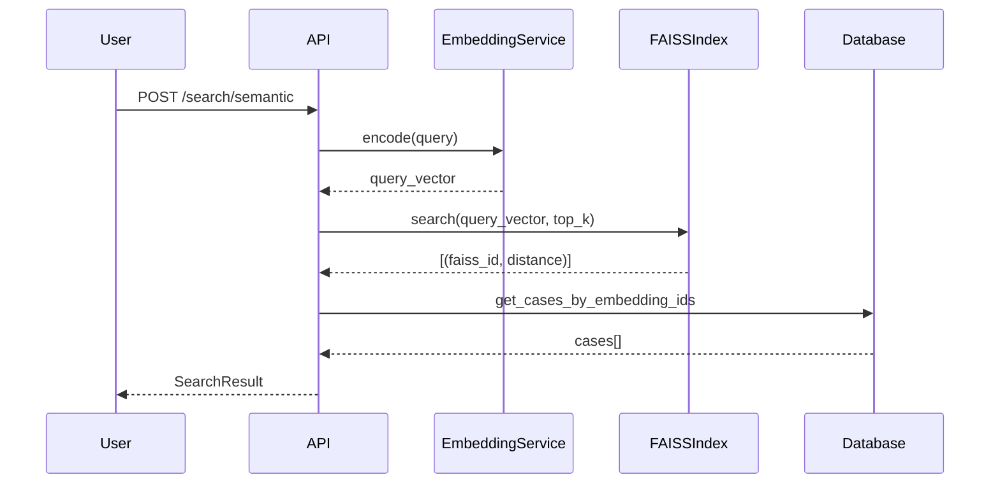
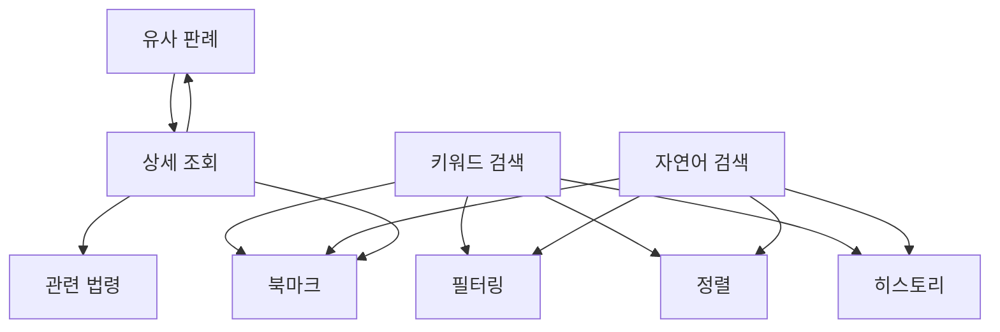

# 기능 정의서

## 1. 개요

본 문서는 법률 판례 검색 시스템의 각 기능별 상세 명세입니다.

---

## 2. 기능 목록

| ID | 기능명 | 상태 | API 엔드포인트 |
|----|--------|------|----------------|
| F001 | 키워드 검색 | ✅ 구현 완료 | `GET /api/cases?q=검색어` |
| F002 | 자연어 검색 | ✅ 구현 완료 | `GET /api/similarity/search?q=검색어` |
| F003 | 유사 판례 검색 | ✅ 구현 완료 | `GET /api/similarity/by-case/{id}` |
| F004 | 판례 상세 조회 | ✅ 구현 완료 | `GET /api/cases/{id}` |
| F005 | 검색 필터링 | ✅ 구현 완료 | `GET /api/cases?court_name=&case_type=&date_from=` |
| F006 | 검색 결과 정렬 | ✅ 구현 완료 | `GET /api/cases?sort_by=decision_date&order=desc` |
| F007 | 헌재결정례 검색 | ✅ 구현 완료 | `GET /constitutional` (SSR 페이지) |
| F008 | 법령해석례 검색 | ✅ 구현 완료 | `GET /interpretations` (SSR 페이지) |
| F009 | 북마크 기능 | ✅ 구현 완료 | `POST/DELETE /api/bookmarks` |
| F010 | 검색 히스토리 | ✅ 구현 완료 | `GET /api/stats/recent-searches` |
| F011 | 관련 법령 조회 | ✅ 구현 완료 | `GET /api/laws/{id}` |
| F012 | 통계 대시보드 | ✅ 구현 완료 | `GET /stats` (SSR 페이지) |
| F013 | 법령용어 툴팁 | ✅ 구현 완료 | `GET /api/law-terms/{term}` |
| F014 | 목차 표시 | ✅ 구현 완료 | `GET /api/cases/{id}/toc` |
| F015 | 본문 요약 | ✅ 구현 완료 | `GET /api/cases/{id}/summary` |
| F016 | 법령 연혁 | ✅ 구현 완료 | `GET /api/laws/{id}/history` |
| F017 | 참조조문 연동 | ✅ 구현 완료 | `GET /api/cases/{id}/reference-provisions` |
| F018 | 참조판례 연동 | ✅ 구현 완료 | `GET /api/cases/{id}/reference-cases` |

---

## 3. 기능 상세 정의

### F001: 키워드 검색

#### 3.1.1 기능 개요

| 항목 | 내용 |
|------|------|
| 기능 ID | F001 |
| 기능명 | 키워드 검색 |
| 담당 모듈 | search_service.py |

#### 3.1.2 기능 설명

사용자가 입력한 키워드를 기반으로 판례 데이터베이스에서 관련 판례를 검색합니다.

#### 3.1.3 입력값

| 입력항목 | 타입 | 필수 | 설명 | 예시 |
|----------|------|------|------|------|
| 검색어 | String | ✅ | 검색할 키워드 | "손해배상" |
| 검색 범위 | String[] | - | 검색 대상 필드 | ["title", "holding", "summary"] |

#### 3.1.4 처리 로직

```
1. 입력값 유효성 검증
   - 검색어 최소 1자 이상
   - 특수문자 이스케이프 처리
   
2. 검색어 전처리
   - 공백 기준 토큰화
   - 불용어 제거 (선택적)
   
3. 데이터베이스 검색
   - PostgreSQL: to_tsvector + ts_query
   - SQLite: LIKE 또는 FTS5
   
4. 결과 랭킹
   - 제목 매칭: 가중치 높음
   - 판시사항 매칭: 가중치 중간
   - 본문 매칭: 가중치 낮음
   
5. 결과 반환
   - 페이지네이션 적용
   - 하이라이트 처리
```

#### 3.1.5 출력값

| 출력항목 | 타입 | 설명 |
|----------|------|------|
| 검색 결과 목록 | Case[] | 판례 리스트 |
| 전체 건수 | Integer | 검색된 총 건수 |
| 검색어 하이라이트 | String[] | 매칭된 텍스트 부분 |

#### 3.1.6 예외 처리

| 예외 상황 | 처리 방법 |
|-----------|-----------|
| 검색어 없음 | 400 Bad Request 반환 |
| 검색 결과 없음 | 빈 배열 반환 + 안내 메시지 |
| DB 연결 오류 | 500 Error + 재시도 안내 |

#### 3.1.7 비즈니스 규칙

- 검색어 최대 길이: 200자
- 페이지당 최대 결과: 100건
- 검색 제한 시간: 10초

---

### F002: 자연어 검색

#### 3.2.1 기능 개요

| 항목 | 내용 |
|------|------|
| 기능 ID | F002 |
| 기능명 | 자연어 검색 (Semantic Search) |
| 담당 모듈 | embedding_service.py |

#### 3.2.2 기능 설명

일상 언어로 작성된 질의문을 벡터로 변환하여 의미적으로 유사한 판례를 검색합니다.

#### 3.2.3 입력값

| 입력항목 | 타입 | 필수 | 설명 | 예시 |
|----------|------|------|------|------|
| 질의문 | String | ✅ | 자연어 검색 질의 | "층간소음으로 피해를 입었을 때 보상받을 수 있는지" |
| 결과 수 | Integer | - | 반환할 결과 수 | 10 |
| 최소 유사도 | Float | - | 임계값 (0~1) | 0.5 |

#### 3.2.4 처리 로직

```
1. 입력값 유효성 검증
   - 질의문 최소 10자 이상
   
2. 질의문 전처리
   - 불필요한 문자 제거
   - 정규화
   
3. 임베딩 생성
   - Sentence Transformers 모델 로드
   - 질의문 → 768차원 벡터 변환
   
4. 벡터 검색
   - FAISS 인덱스에서 유사 벡터 검색
   - 코사인 유사도 계산
   
5. 결과 필터링
   - 최소 유사도 이하 제거
   - 상위 K개 선택
   
6. 결과 보강
   - 벡터 ID → 판례 ID 매핑
   - 판례 상세 정보 조회
```

#### 3.2.5 출력값

| 출력항목 | 타입 | 설명 |
|----------|------|------|
| 검색 결과 목록 | Case[] | 유사 판례 리스트 |
| 유사도 점수 | Float[] | 각 결과의 유사도 (0~1) |
| 임베딩 소요 시간 | Integer | ms 단위 |
| 검색 소요 시간 | Integer | ms 단위 |

#### 3.2.6 시퀀스 다이어그램



---

### F003: 유사 판례 검색

#### 3.3.1 기능 개요

| 항목 | 내용 |
|------|------|
| 기능 ID | F003 |
| 기능명 | 유사 판례 검색 |
| 담당 모듈 | embedding_service.py |

#### 3.3.2 기능 설명

특정 판례와 의미적으로 유사한 다른 판례들을 검색합니다.

#### 3.3.3 처리 로직

```
1. 기준 판례 조회
   - 판례 ID로 판례 정보 조회
   - 해당 판례의 임베딩 ID 조회
   
2. FAISS 인덱스 검색
   - 기준 벡터와 유사한 벡터 검색
   - 자기 자신 제외
   
3. 결과 정제
   - 유사도 점수 정렬
   - 공통 키워드 추출 (선택적)
```

#### 3.3.4 입출력

**입력:**
- case_id: 기준 판례 ID
- top_k: 반환할 유사 판례 수

**출력:**
- 유사 판례 목록 (유사도 점수 포함)
- 공통 키워드 목록

---

### F004: 판례 상세 조회

#### 3.4.1 기능 개요

| 항목 | 내용 |
|------|------|
| 기능 ID | F004 |
| 기능명 | 판례 상세 조회 |
| 담당 모듈 | case_service.py |

#### 3.4.2 기능 설명

판례의 전체 상세 정보를 조회합니다.

#### 3.4.3 조회 정보

| 정보 | 설명 |
|------|------|
| 기본 정보 | 사건번호, 선고일, 법원, 사건유형 |
| 판시사항 | 핵심 법리 |
| 판결요지 | 판결 요약 |
| 판례 전문 | 판결문 전체 텍스트 |
| 참조조문 | 관련 법령 조문 목록 |
| 참조판례 | 인용된 다른 판례 목록 |
| 유사 판례 | AI 분석 유사 판례 |

#### 3.4.4 화면 구성

```
┌─────────────────────────────────────────────────────────────┐
│ 🔍 판례 상세                                    [북마크] [공유] │
├─────────────────────────────────────────────────────────────┤
│                                                             │
│ 📋 기본 정보                                                 │
│ ┌─────────────────────────────────────────────────────────┐ │
│ │ 사건번호: 2023다12345                                    │ │
│ │ 선고일: 2023-12-15                                       │ │
│ │ 법원: 대법원                                             │ │
│ │ 사건유형: 민사 / 손해배상(기)                              │ │
│ └─────────────────────────────────────────────────────────┘ │
│                                                             │
│ 📌 판시사항                                                 │
│ ┌─────────────────────────────────────────────────────────┐ │
│ │ [1] 불법행위로 인한 손해배상청구에서...                     │ │
│ │ [2] 위자료 산정의 기준...                                 │ │
│ └─────────────────────────────────────────────────────────┘ │
│                                                             │
│ 📝 판결요지                                                 │
│ ┌─────────────────────────────────────────────────────────┐ │
│ │ [1] 불법행위로 인한 손해배상책임이 성립하려면...            │ │
│ └─────────────────────────────────────────────────────────┘ │
│                                                             │
│ 📖 판례 전문                           [전체보기] [접기]      │
│ ┌─────────────────────────────────────────────────────────┐ │
│ │ 【원고, 피상고인】 원고                                   │ │
│ │ 【피고, 상고인】 피고                                     │ │
│ │ ...                                                     │ │
│ └─────────────────────────────────────────────────────────┘ │
│                                                             │
│ 📚 참조조문                                                 │
│ ┌─────────────────────────────────────────────────────────┐ │
│ │ • 민법 제750조 (불법행위의 내용)                          │ │
│ │ • 민법 제751조 (재산 이외의 손해의 배상)                   │ │
│ └─────────────────────────────────────────────────────────┘ │
│                                                             │
│ 🔗 참조판례                                                 │
│ ┌─────────────────────────────────────────────────────────┐ │
│ │ • 대법원 2020. 1. 1. 선고 2019다12345 판결               │ │
│ │ • 대법원 2019. 6. 15. 선고 2018다98765 판결              │ │
│ └─────────────────────────────────────────────────────────┘ │
│                                                             │
│ 🤖 AI 분석 유사판례                                         │
│ ┌─────────────────────────────────────────────────────────┐ │
│ │ 1. 2022다98765 손해배상(기) - 유사도 92%                  │ │
│ │ 2. 2021다54321 손해배상(자) - 유사도 87%                  │ │
│ │ 3. 2020다11111 손해배상(기) - 유사도 85%                  │ │
│ └─────────────────────────────────────────────────────────┘ │
│                                                             │
└─────────────────────────────────────────────────────────────┘
```

---

### F005: 검색 필터링

#### 3.5.1 기능 개요

| 항목 | 내용 |
|------|------|
| 기능 ID | F005 |
| 기능명 | 검색 필터링 |
| 담당 모듈 | search_service.py |

#### 3.5.2 필터 항목

| 필터 | 타입 | 옵션 |
|------|------|------|
| 법원 | Multi-select | 대법원, 고등법원, 지방법원, ... |
| 사건유형 | Multi-select | 민사, 형사, 행정, 가사, ... |
| 판결유형 | Single-select | 판결, 결정, 명령 |
| 기간 | Date Range | 시작일 ~ 종료일 |

#### 3.5.3 필터 적용 로직

```python
def apply_filters(query, filters: dict):
    """검색 쿼리에 필터 적용"""
    
    if filters.get("courts"):
        query = query.filter(Case.court_id.in_(filters["courts"]))
    
    if filters.get("case_types"):
        query = query.filter(Case.case_type_id.in_(filters["case_types"]))
    
    if filters.get("judgment_type"):
        query = query.filter(Case.judgment_type == filters["judgment_type"])
    
    if filters.get("from_date"):
        query = query.filter(Case.decision_date >= filters["from_date"])
    
    if filters.get("to_date"):
        query = query.filter(Case.decision_date <= filters["to_date"])
    
    return query
```

---

### F006: 검색 결과 정렬

#### 3.6.1 정렬 옵션

| 정렬 기준 | 코드 | 설명 |
|-----------|------|------|
| 관련도순 | relevance | 검색어 매칭 점수 기준 (기본값) |
| 최신순 | date_desc | 선고일 내림차순 |
| 오래된순 | date_asc | 선고일 오름차순 |
| 법원순 | court | 법원 중요도 순 (대법원 > 고등법원 > ...) |

---

### F007: 헌재결정례 검색

#### 3.7.1 기능 설명

헌법재판소 결정례를 검색합니다.

#### 3.7.2 검색 필드

- 사건명
- 사건번호
- 결정유형 (위헌, 합헌, 헌법불합치 등)
- 결정요지

#### 3.7.3 필터 옵션

| 필터 | 옵션 |
|------|------|
| 결정유형 | 위헌, 합헌, 헌법불합치, 한정합헌, 한정위헌, 각하 |
| 사건유형 | 위헌법률심판, 헌법소원심판, 권한쟁의심판, ... |
| 기간 | 시작일 ~ 종료일 |

---

### F008: 법령해석례 검색

#### 3.8.1 기능 설명

법제처 법령해석례를 검색합니다.

#### 3.8.2 검색 필드

- 제목
- 질의요지
- 회답내용
- 관계법령

---

### F009: 북마크 기능

#### 3.9.1 기능 설명

관심 있는 판례를 저장하여 나중에 다시 확인할 수 있습니다.

#### 3.9.2 저장 방식

- **로컬 스토리지**: 브라우저 Local Storage 활용
- **서버 저장** (선택적): 세션 ID 기반 DB 저장

#### 3.9.3 기능 목록

| 기능 | 설명 |
|------|------|
| 북마크 추가 | 판례 상세 페이지에서 북마크 버튼 클릭 |
| 북마크 제거 | 북마크된 판례에서 해제 버튼 클릭 |
| 북마크 목록 | 저장된 북마크 전체 조회 |
| 북마크 내보내기 | JSON 형식으로 내보내기 |

#### 3.9.4 데이터 구조 (Local Storage)

```javascript
// localStorage key: "judicial_bookmarks"
{
  "bookmarks": [
    {
      "case_id": 12345,
      "case_number": "2023다12345",
      "case_name": "손해배상(기)",
      "court_name": "대법원",
      "decision_date": "2023-12-15",
      "bookmarked_at": "2023-12-20T10:30:00Z"
    }
  ]
}
```

---

### F010: 검색 히스토리

#### 3.10.1 기능 설명

이전 검색 기록을 저장하고 재검색할 수 있습니다.

#### 3.10.2 저장 항목

- 검색어
- 검색 유형 (키워드/자연어)
- 적용된 필터
- 검색 시간

#### 3.10.3 UI 동작

1. 검색창 포커스 시 최근 검색어 드롭다운 표시
2. 검색어 클릭 시 해당 검색 재실행
3. 개별/전체 삭제 기능

---

### F011: 관련 법령 조회

#### 3.11.1 기능 설명

판례에서 인용된 법령의 상세 정보를 조회합니다.

#### 3.11.2 처리 로직

```
1. 참조조문 텍스트 파싱
   - "민법 제750조" → law_name: "민법", article: "제750조"
   
2. 법령 DB 조회
   - 법령명으로 법령 검색
   - 조문 번호로 해당 조문 조회
   
3. 결과 표시
   - 조문 내용 표시
   - 법령 전체로 이동 링크
```

---

### F012: 통계 대시보드

#### 3.12.1 기능 설명

시스템 현황 및 검색 통계를 시각화합니다.

#### 3.12.2 표시 항목

| 항목 | 설명 |
|------|------|
| 총 판례 수 | 수집된 전체 판례 건수 |
| 법원별 분포 | 법원별 판례 건수 차트 |
| 연도별 추이 | 연도별 판례 증가 추이 |
| 인기 검색어 | 최근 7일 인기 검색어 TOP 10 |
| 시스템 상태 | DB, 인덱스, 모델 상태 |

---

## 4. 기능 간 의존성



---

## 5. 성능 요구사항

| 기능 | 응답 시간 목표 | 동시 처리 |
|------|---------------|-----------|
| F001 키워드 검색 | < 300ms | 50 req/s |
| F002 자연어 검색 | < 1000ms | 20 req/s |
| F003 유사 판례 | < 500ms | 30 req/s |
| F004 상세 조회 | < 200ms | 100 req/s |

---

## 6. 테스트 케이스

### 6.1 키워드 검색 테스트

| TC ID | 테스트 케이스 | 예상 결과 |
|-------|-------------|-----------|
| TC-F001-01 | "손해배상" 검색 | 관련 판례 목록 반환 |
| TC-F001-02 | 빈 검색어 | 400 에러 |
| TC-F001-03 | 특수문자만 검색 | 빈 결과 + 안내 메시지 |
| TC-F001-04 | 200자 초과 검색어 | 400 에러 |

### 6.2 자연어 검색 테스트

| TC ID | 테스트 케이스 | 예상 결과 |
|-------|-------------|-----------|
| TC-F002-01 | "이웃 소음 피해 보상" | 층간소음 관련 판례 반환 |
| TC-F002-02 | 10자 미만 질의 | 400 에러 |
| TC-F002-03 | 영문 질의 | 결과 반환 (다국어 모델) |

### 6.3 필터 테스트

| TC ID | 테스트 케이스 | 예상 결과 |
|-------|-------------|-----------|
| TC-F005-01 | 대법원 필터 | 대법원 판례만 반환 |
| TC-F005-02 | 2023년 기간 필터 | 2023년 판례만 반환 |
| TC-F005-03 | 복합 필터 | 조건 AND 결합 결과 |
