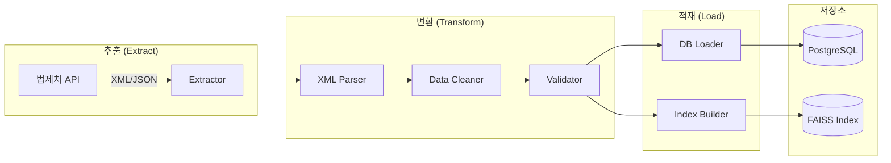

# ETL 설계

## 1. 개요

본 문서는 법제처 OpenAPI로부터 데이터를 수집(Extract), 변환(Transform), 적재(Load)하는 ETL 파이프라인의 상세 설계입니다.

---

## 1.1 핵심 요구사항

ETL 파이프라인의 핵심 구현 요구사항입니다.

| # | 요구사항 | 설명 | 상태 |
|---|----------|------|------|
| 1 | **JSON API 실패 시 HTML Fallback** | `type=json` 요청 실패 시 `type=HTML` API로 재요청하여 데이터 추출 | ✅ 완료 |
| 2 | **판례 상세 API 본문 조회** | 판례 상세 본문 내용(판결요지, 전문 등) 정상 조회 및 파싱 | ✅ 완료 |
| 3 | **사건번호 파싱** | "서울고등법원-2022-누-38108" 형식에서 법원명과 사건번호 분리 추출 | ✅ 완료 |
| 4 | **법원명 자동 추출** | 사건번호(예: 93누1077)에서 사건종류(누, 다, 고 등)로 법원명 추정 | ✅ 완료 |
| 5 | **유사도 검색용 임베딩** | 판례 텍스트를 KoSBERT로 임베딩하여 FAISS 인덱스 구축 | ✅ 완료 |
| 6 | **법률용어 툴팁** | 참조조문 내 법령 용어에 대한 정의 표시 | ✅ 완료 |
| 7 | **고급 검색 UI** | 법원, 사건유형, 날짜 등 필터 검색 | ✅ 완료 |
| 8 | **설계문서 반영** | 모든 요구사항을 설계문서에 문서화 | ✅ 완료 |

### 1.1.1 JSON → HTML Fallback 상세

```
[요청 흐름]
1. JSON API 요청: GET /DRF/lawService.do?OC={key}&target=prec&ID={id}&type=json
2. 응답 검증:
   - 정상 응답 (사건명 존재) → 완료
   - 오류 응답 또는 빈 데이터 → HTML API로 전환
3. HTML API 요청: GET /DRF/lawService.do?OC={key}&target=prec&ID={id}&type=HTML
4. iframe src URL 추출 → 실제 페이지 요청 → HTML 파싱
```

### 1.1.2 사건번호 파싱 규칙

| 입력 형식 | 파싱 결과 |
|-----------|-----------|
| `서울고등법원-2022-누-38108` | court_name: `서울고등법원`, case_number: `2022누38108` |
| `대법원-2025-두-34568` | court_name: `대법원`, case_number: `2025두34568` |
| `2023다12345` | court_name: 사건종류코드로 추정, case_number: `2023다12345` |
| `93누1077` | court_name: `고등법원` (누=행정), case_number: `93누1077` |

### 1.1.3 사건종류 → 법원 매핑

| 사건종류코드 | 법원 | 비고 |
|--------------|------|------|
| 다, 가, 나, 마, 바, 라 | 대법원/지방법원 | 민사 |
| 도, 고, 노, 모, 오 | 대법원/지방법원 | 형사 |
| 누, 두, 부, 무, 추 | 고등법원/대법원 | 행정 |
| 헌가, 헌나, 헌다, 헌라, 헌마, 헌바, 헌사, 헌아 | 헌법재판소 | 헌법 |
| 재, 스 | 대법원/가정법원 | 가사 |

---

## 2. ETL 파이프라인 개요



---

## 3. 디렉토리 구조

```
etl/
├── __init__.py
├── config.py                    # ETL 설정
├── main.py                      # ETL 실행 진입점
│
├── api_client/                  # 법제처 API 클라이언트
│   ├── __init__.py
│   ├── base_client.py           # 공통 HTTP 클라이언트
│   ├── case_client.py           # 판례 API
│   ├── constitutional_client.py  # 헌재결정례 API
│   └── interpretation_client.py  # 법령해석례 API
│
├── extractors/                  # 데이터 추출기
│   ├── __init__.py
│   ├── base_extractor.py
│   ├── case_extractor.py
│   └── batch_extractor.py
│
├── transformers/                # 데이터 변환기
│   ├── __init__.py
│   ├── xml_parser.py
│   ├── data_cleaner.py
│   └── text_processor.py
│
├── loaders/                     # 데이터 적재기
│   ├── __init__.py
│   ├── db_loader.py
│   └── embedding_loader.py
│
├── pipelines/                   # 파이프라인 정의
│   ├── __init__.py
│   ├── case_pipeline.py
│   ├── constitutional_pipeline.py
│   └── full_sync_pipeline.py
│
└── utils/                       # 유틸리티
    ├── __init__.py
    ├── rate_limiter.py
    └── logger.py
```

---

## 4. API 클라이언트 설계

### 4.1 Base Client

```python
# etl/api_client/base_client.py

import aiohttp
import asyncio
from typing import Optional, Dict, Any
from dataclasses import dataclass
import logging

logger = logging.getLogger(__name__)

@dataclass
class APIConfig:
    base_url: str = "http://www.law.go.kr/DRF"
    api_key: str = ""
    timeout: int = 30
    max_retries: int = 3
    retry_delay: float = 1.0
    rate_limit: float = 0.1  # 초당 10건

class BaseAPIClient:
    def __init__(self, config: APIConfig):
        self.config = config
        self._session: Optional[aiohttp.ClientSession] = None
        self._last_request_time = 0
    
    async def _get_session(self) -> aiohttp.ClientSession:
        if self._session is None or self._session.closed:
            timeout = aiohttp.ClientTimeout(total=self.config.timeout)
            self._session = aiohttp.ClientSession(timeout=timeout)
        return self._session
    
    async def _rate_limit(self):
        """Rate limiting 적용"""
        import time
        elapsed = time.time() - self._last_request_time
        if elapsed < self.config.rate_limit:
            await asyncio.sleep(self.config.rate_limit - elapsed)
        self._last_request_time = time.time()
    
    async def request(
        self,
        endpoint: str,
        params: Dict[str, Any],
        method: str = "GET"
    ) -> Optional[str]:
        """API 요청 (재시도 포함)"""
        await self._rate_limit()
        
        params["OC"] = self.config.api_key
        url = f"{self.config.base_url}/{endpoint}"
        
        for attempt in range(self.config.max_retries):
            try:
                session = await self._get_session()
                async with session.request(method, url, params=params) as response:
                    if response.status == 200:
                        return await response.text()
                    elif response.status == 429:  # Rate limit exceeded
                        delay = self.config.retry_delay * (attempt + 1)
                        logger.warning(f"Rate limit exceeded, waiting {delay}s")
                        await asyncio.sleep(delay)
                    else:
                        logger.error(f"API error: {response.status}")
                        return None
                        
            except asyncio.TimeoutError:
                logger.warning(f"Timeout, attempt {attempt + 1}/{self.config.max_retries}")
                await asyncio.sleep(self.config.retry_delay)
            except Exception as e:
                logger.error(f"Request error: {e}")
                await asyncio.sleep(self.config.retry_delay)
        
        return None
    
    async def close(self):
        if self._session and not self._session.closed:
            await self._session.close()
```

### 4.2 Case Client (판례 API 클라이언트)

```python
# etl/api_client/case_client.py

from typing import List, Optional, Dict, Any
from dataclasses import dataclass
from .base_client import BaseAPIClient, APIConfig

@dataclass
class CaseListParams:
    query: Optional[str] = None
    court: Optional[str] = None
    case_type: Optional[str] = None
    from_date: Optional[str] = None
    to_date: Optional[str] = None
    page: int = 1
    display: int = 100
    sort: str = "ddes"  # 최신순

class CaseAPIClient(BaseAPIClient):
    """판례 API 클라이언트"""
    
    async def get_case_list(self, params: CaseListParams) -> Optional[str]:
        """판례 목록 조회"""
        api_params = {
            "target": "prec",
            "type": "XML",
            "display": params.display,
            "page": params.page,
            "sort": params.sort
        }
        
        if params.query:
            api_params["query"] = params.query
        if params.court:
            api_params["curt"] = params.court
        if params.case_type:
            api_params["caseTy"] = params.case_type
        if params.from_date:
            api_params["fromDt"] = params.from_date
        if params.to_date:
            api_params["toDt"] = params.to_date
        
        return await self.request("lawSearch.do", api_params)
    
    async def get_case_detail(self, serial_number: str) -> Optional[str]:
        """판례 본문 조회"""
        api_params = {
            "target": "prec",
            "type": "XML",
            "ID": serial_number
        }
        return await self.request("lawService.do", api_params)
    
    async def get_all_cases(
        self,
        params: CaseListParams,
        max_pages: Optional[int] = None
    ) -> List[Dict[str, Any]]:
        """모든 판례 목록 수집 (페이지네이션 자동 처리)"""
        all_cases = []
        current_page = 1
        
        while True:
            params.page = current_page
            response = await self.get_case_list(params)
            
            if not response:
                break
            
            cases, total_count = self._parse_case_list(response)
            all_cases.extend(cases)
            
            # 다음 페이지 확인
            if len(cases) < params.display:
                break
            if max_pages and current_page >= max_pages:
                break
            
            current_page += 1
        
        return all_cases
    
    def _parse_case_list(self, xml_response: str) -> tuple:
        """XML 응답에서 판례 목록 파싱"""
        from etl.transformers.xml_parser import CaseXMLParser
        parser = CaseXMLParser()
        return parser.parse_list(xml_response)
```

---

## 5. 변환기 (Transformer) 설계

### 5.1 XML Parser

```python
# etl/transformers/xml_parser.py

import xml.etree.ElementTree as ET
from typing import Dict, Any, List, Tuple, Optional
from dataclasses import dataclass
from datetime import datetime
import re

@dataclass
class CaseData:
    serial_number: str
    case_name: str
    case_number: str
    decision_date: str
    decision_type: Optional[str]
    court_name: str
    court_code: Optional[str]
    case_type: str
    case_type_code: Optional[str]
    judgment_type: Optional[str]
    holding: Optional[str]
    summary: Optional[str]
    full_text: Optional[str]
    reference_articles: Optional[str]
    reference_cases: Optional[str]

class CaseXMLParser:
    """판례 XML 파서"""
    
    # XML 태그 매핑
    TAG_MAP = {
        "판례일련번호": "serial_number",
        "판례정보일련번호": "serial_number",
        "사건명": "case_name",
        "사건번호": "case_number",
        "선고일자": "decision_date",
        "선고": "decision_type",
        "법원명": "court_name",
        "법원종류코드": "court_code",
        "사건종류명": "case_type",
        "사건종류코드": "case_type_code",
        "판결유형": "judgment_type",
        "판시사항": "holding",
        "판결요지": "summary",
        "판례내용": "full_text",
        "참조조문": "reference_articles",
        "참조판례": "reference_cases",
    }
    
    def parse_list(self, xml_str: str) -> Tuple[List[Dict], int]:
        """목록 응답 파싱"""
        try:
            root = ET.fromstring(xml_str)
            
            # 전체 건수
            total_elem = root.find("totalCnt")
            total_count = int(total_elem.text) if total_elem is not None else 0
            
            # 판례 목록
            cases = []
            for prec_elem in root.findall(".//prec"):
                case_data = self._parse_case_element(prec_elem)
                cases.append(case_data)
            
            return cases, total_count
            
        except ET.ParseError as e:
            raise ValueError(f"XML 파싱 오류: {e}")
    
    def parse_detail(self, xml_str: str) -> Dict[str, Any]:
        """본문 응답 파싱"""
        try:
            root = ET.fromstring(xml_str)
            return self._parse_case_element(root)
        except ET.ParseError as e:
            raise ValueError(f"XML 파싱 오류: {e}")
    
    def _parse_case_element(self, elem: ET.Element) -> Dict[str, Any]:
        """판례 요소 파싱"""
        data = {}
        
        for child in elem:
            tag_name = child.tag
            field_name = self.TAG_MAP.get(tag_name)
            
            if field_name:
                text = child.text.strip() if child.text else None
                data[field_name] = text
        
        return data
```

### 5.2 Data Cleaner

```python
# etl/transformers/data_cleaner.py

import re
from typing import Dict, Any, Optional
from datetime import datetime, date

class DataCleaner:
    """데이터 정제기"""
    
    def clean_case_data(self, raw_data: Dict[str, Any]) -> Dict[str, Any]:
        """판례 데이터 정제"""
        cleaned = {}
        
        # 필수 필드 검증
        required = ["serial_number", "case_name", "case_number", "decision_date"]
        for field in required:
            if not raw_data.get(field):
                raise ValueError(f"필수 필드 누락: {field}")
        
        # 기본 필드 복사 및 정제
        cleaned["serial_number"] = self._clean_text(raw_data["serial_number"])
        cleaned["case_name"] = self._clean_text(raw_data["case_name"])
        cleaned["case_number"] = self._clean_case_number(raw_data["case_number"])
        cleaned["decision_date"] = self._parse_date(raw_data["decision_date"])
        
        # 선택 필드
        cleaned["decision_type"] = self._clean_text(raw_data.get("decision_type"))
        cleaned["court_name"] = self._clean_text(raw_data.get("court_name"))
        cleaned["court_code"] = raw_data.get("court_code")
        cleaned["case_type"] = self._clean_text(raw_data.get("case_type"))
        cleaned["case_type_code"] = raw_data.get("case_type_code")
        cleaned["judgment_type"] = self._clean_text(raw_data.get("judgment_type"))
        
        # 텍스트 필드
        cleaned["holding"] = self._clean_long_text(raw_data.get("holding"))
        cleaned["summary"] = self._clean_long_text(raw_data.get("summary"))
        cleaned["full_text"] = self._clean_long_text(raw_data.get("full_text"))
        cleaned["reference_articles"] = self._clean_long_text(raw_data.get("reference_articles"))
        cleaned["reference_cases"] = self._clean_long_text(raw_data.get("reference_cases"))
        
        # 검색용 통합 텍스트 생성
        cleaned["search_text"] = self._build_search_text(cleaned)
        
        return cleaned
    
    def _clean_text(self, text: Optional[str]) -> Optional[str]:
        """기본 텍스트 정제"""
        if not text:
            return None
        # 앞뒤 공백 제거
        text = text.strip()
        # 연속 공백 제거
        text = re.sub(r'\s+', ' ', text)
        return text if text else None
    
    def _clean_long_text(self, text: Optional[str]) -> Optional[str]:
        """긴 텍스트 정제"""
        if not text:
            return None
        
        # 기본 정제
        text = text.strip()
        
        # HTML 엔티티 디코딩
        import html
        text = html.unescape(text)
        
        # 제어 문자 제거
        text = re.sub(r'[\x00-\x08\x0b\x0c\x0e-\x1f\x7f]', '', text)
        
        return text if text else None
    
    def _clean_case_number(self, case_number: str) -> str:
        """사건번호 정규화"""
        # 공백 제거
        case_number = case_number.replace(" ", "")
        return case_number
    
    def _parse_date(self, date_str: str) -> date:
        """날짜 파싱"""
        # YYYYMMDD 형식
        if len(date_str) == 8 and date_str.isdigit():
            return datetime.strptime(date_str, "%Y%m%d").date()
        
        # YYYY-MM-DD 형식
        if re.match(r'\d{4}-\d{2}-\d{2}', date_str):
            return datetime.strptime(date_str, "%Y-%m-%d").date()
        
        # YYYY.MM.DD 형식
        if re.match(r'\d{4}\.\d{2}\.\d{2}', date_str):
            return datetime.strptime(date_str, "%Y.%m.%d").date()
        
        raise ValueError(f"날짜 형식 오류: {date_str}")
    
    def _build_search_text(self, data: Dict[str, Any]) -> str:
        """검색용 통합 텍스트 생성"""
        parts = [
            data.get("case_name", ""),
            data.get("case_number", ""),
            data.get("holding", ""),
            data.get("summary", ""),
        ]
        return " ".join(filter(None, parts))
```

### 5.3 Reference Parser (참조조문/참조판례 파싱)

```python
# etl/transformers/reference_parser.py

import re
from typing import List, Dict, Optional
from dataclasses import dataclass

@dataclass
class ReferenceArticle:
    law_name: str
    article_number: str
    article_content: Optional[str] = None

@dataclass
class ReferenceCase:
    case_number: str
    court_name: Optional[str] = None
    decision_date: Optional[str] = None

class ReferenceParser:
    """참조조문/참조판례 파서"""
    
    def parse_reference_articles(self, text: str) -> List[ReferenceArticle]:
        """참조조문 파싱"""
        if not text:
            return []
        
        results = []
        # 패턴: "법령명 제XXX조", "법령명 제XXX조의X"
        pattern = r'([가-힣]+법(?:\s*시행령|\s*시행규칙)?)\s*제?(\d+조(?:의\d+)?(?:\s*제\d+항)?)'
        
        for match in re.finditer(pattern, text):
            law_name = match.group(1).strip()
            article = f"제{match.group(2)}" if not match.group(2).startswith("제") else match.group(2)
            results.append(ReferenceArticle(
                law_name=law_name,
                article_number=article
            ))
        
        return results
    
    def parse_reference_cases(self, text: str) -> List[ReferenceCase]:
        """참조판례 파싱"""
        if not text:
            return []
        
        results = []
        # 패턴: "대법원 YYYY. M. D. 선고 XXX다XXXXX 판결"
        pattern = r'(대법원|고등법원|지방법원[가-힣]*)\s*(\d{4})\.\s*(\d{1,2})\.\s*(\d{1,2})\.\s*선고\s*(\d+[가-힣]+\d+)\s*(판결|결정)'
        
        for match in re.finditer(pattern, text):
            court = match.group(1)
            year = match.group(2)
            month = match.group(3).zfill(2)
            day = match.group(4).zfill(2)
            case_num = match.group(5)
            
            results.append(ReferenceCase(
                case_number=case_num,
                court_name=court,
                decision_date=f"{year}-{month}-{day}"
            ))
        
        return results
```

---

## 6. 적재기 (Loader) 설계

### 6.1 DB Loader

```python
# etl/loaders/db_loader.py

from typing import Dict, Any, List, Optional
from sqlalchemy.orm import Session
from sqlalchemy.dialects.postgresql import insert
from datetime import datetime
import logging

from app.models.case import Case, CaseReferenceArticle, CaseReferenceCase
from app.models.court import Court
from app.models.case_type import CaseType

logger = logging.getLogger(__name__)

class DBLoader:
    """데이터베이스 적재기"""
    
    def __init__(self, session: Session):
        self.session = session
        self._court_cache: Dict[str, int] = {}
        self._case_type_cache: Dict[str, int] = {}
    
    async def load_case(self, data: Dict[str, Any]) -> int:
        """판례 데이터 적재 (Upsert)"""
        try:
            # 법원, 사건유형 ID 조회
            court_id = self._get_court_id(data.get("court_code"))
            case_type_id = self._get_case_type_id(data.get("case_type_code"))
            
            # 기존 데이터 확인
            existing = self.session.query(Case).filter(
                Case.serial_number == data["serial_number"]
            ).first()
            
            if existing:
                # 업데이트
                for key, value in data.items():
                    if hasattr(existing, key) and value is not None:
                        setattr(existing, key, value)
                existing.court_id = court_id
                existing.case_type_id = case_type_id
                existing.updated_at = datetime.utcnow()
                case_id = existing.id
                logger.debug(f"Updated case: {data['serial_number']}")
            else:
                # 신규 생성
                case = Case(
                    serial_number=data["serial_number"],
                    case_name=data["case_name"],
                    case_number=data["case_number"],
                    decision_date=data["decision_date"],
                    decision_type=data.get("decision_type"),
                    court_id=court_id,
                    case_type_id=case_type_id,
                    judgment_type=data.get("judgment_type"),
                    holding=data.get("holding"),
                    summary=data.get("summary"),
                    full_text=data.get("full_text"),
                    reference_articles_raw=data.get("reference_articles"),
                    reference_cases_raw=data.get("reference_cases"),
                    search_text=data.get("search_text"),
                )
                self.session.add(case)
                self.session.flush()
                case_id = case.id
                logger.debug(f"Created case: {data['serial_number']}")
            
            self.session.commit()
            return case_id
            
        except Exception as e:
            self.session.rollback()
            logger.error(f"Failed to load case {data.get('serial_number')}: {e}")
            raise
    
    async def load_cases_batch(
        self,
        cases: List[Dict[str, Any]],
        batch_size: int = 100
    ) -> int:
        """배치 적재"""
        loaded_count = 0
        
        for i in range(0, len(cases), batch_size):
            batch = cases[i:i + batch_size]
            
            for case_data in batch:
                try:
                    await self.load_case(case_data)
                    loaded_count += 1
                except Exception as e:
                    logger.error(f"Batch load error: {e}")
                    continue
        
        return loaded_count
    
    def _get_court_id(self, court_code: Optional[str]) -> Optional[int]:
        """법원 ID 조회 (캐싱)"""
        if not court_code:
            return None
        
        if court_code not in self._court_cache:
            court = self.session.query(Court).filter(
                Court.code == court_code
            ).first()
            if court:
                self._court_cache[court_code] = court.id
        
        return self._court_cache.get(court_code)
    
    def _get_case_type_id(self, case_type_code: Optional[str]) -> Optional[int]:
        """사건유형 ID 조회 (캐싱)"""
        if not case_type_code:
            return None
        
        if case_type_code not in self._case_type_cache:
            case_type = self.session.query(CaseType).filter(
                CaseType.code == case_type_code
            ).first()
            if case_type:
                self._case_type_cache[case_type_code] = case_type.id
        
        return self._case_type_cache.get(case_type_code)
```

### 6.2 Embedding Loader

```python
# etl/loaders/embedding_loader.py

import numpy as np
import faiss
from typing import List, Tuple, Optional
from pathlib import Path
import json
import logging

from sentence_transformers import SentenceTransformer

logger = logging.getLogger(__name__)

class EmbeddingLoader:
    """임베딩 및 FAISS 인덱스 적재기"""
    
    def __init__(
        self,
        model_name: str = "jhgan/ko-sroberta-multitask",
        index_path: str = "./data/faiss/index.faiss",
        mapping_path: str = "./data/faiss/id_mapping.json"
    ):
        self.model_name = model_name
        self.index_path = Path(index_path)
        self.mapping_path = Path(mapping_path)
        
        self.model: Optional[SentenceTransformer] = None
        self.index: Optional[faiss.Index] = None
        self.id_mapping: dict = {}  # faiss_id -> case_id
        self.next_faiss_id: int = 0
    
    def load_model(self):
        """임베딩 모델 로드"""
        if self.model is None:
            logger.info(f"Loading model: {self.model_name}")
            self.model = SentenceTransformer(self.model_name)
            logger.info("Model loaded successfully")
    
    def load_or_create_index(self):
        """FAISS 인덱스 로드 또는 생성"""
        if self.index_path.exists():
            logger.info(f"Loading existing index: {self.index_path}")
            self.index = faiss.read_index(str(self.index_path))
            self.next_faiss_id = self.index.ntotal
            
            # ID 매핑 로드
            if self.mapping_path.exists():
                with open(self.mapping_path, 'r') as f:
                    self.id_mapping = json.load(f)
        else:
            logger.info("Creating new FAISS index")
            # L2 거리 기반 Flat 인덱스 (정확도 최우선)
            dimension = 768  # Sentence Transformer 출력 차원
            self.index = faiss.IndexFlatL2(dimension)
            self.next_faiss_id = 0
            self.id_mapping = {}
    
    def encode_text(self, text: str) -> np.ndarray:
        """텍스트 임베딩 생성"""
        if self.model is None:
            self.load_model()
        
        # 텍스트 길이 제한 (모델 최대 입력 길이)
        max_length = 512
        if len(text) > max_length * 4:  # 대략적인 토큰 수 추정
            text = text[:max_length * 4]
        
        embedding = self.model.encode(text, convert_to_numpy=True)
        return embedding.astype('float32')
    
    def encode_batch(self, texts: List[str], batch_size: int = 32) -> np.ndarray:
        """배치 임베딩 생성"""
        if self.model is None:
            self.load_model()
        
        embeddings = self.model.encode(
            texts,
            convert_to_numpy=True,
            batch_size=batch_size,
            show_progress_bar=True
        )
        return embeddings.astype('float32')
    
    def add_embedding(self, case_id: int, embedding: np.ndarray) -> int:
        """단일 임베딩 추가"""
        if self.index is None:
            self.load_or_create_index()
        
        faiss_id = self.next_faiss_id
        self.index.add(embedding.reshape(1, -1))
        self.id_mapping[str(faiss_id)] = case_id
        self.next_faiss_id += 1
        
        return faiss_id
    
    def add_embeddings_batch(
        self,
        case_ids: List[int],
        embeddings: np.ndarray
    ) -> List[int]:
        """배치 임베딩 추가"""
        if self.index is None:
            self.load_or_create_index()
        
        start_id = self.next_faiss_id
        self.index.add(embeddings)
        
        faiss_ids = []
        for i, case_id in enumerate(case_ids):
            faiss_id = start_id + i
            self.id_mapping[str(faiss_id)] = case_id
            faiss_ids.append(faiss_id)
        
        self.next_faiss_id = start_id + len(case_ids)
        return faiss_ids
    
    def save_index(self):
        """인덱스 저장"""
        # 디렉토리 생성
        self.index_path.parent.mkdir(parents=True, exist_ok=True)
        
        # FAISS 인덱스 저장
        faiss.write_index(self.index, str(self.index_path))
        logger.info(f"FAISS index saved: {self.index_path}")
        
        # ID 매핑 저장
        with open(self.mapping_path, 'w') as f:
            json.dump(self.id_mapping, f)
        logger.info(f"ID mapping saved: {self.mapping_path}")
    
    def rebuild_index(self, case_texts: List[Tuple[int, str]]):
        """인덱스 전체 재빌드"""
        logger.info(f"Rebuilding index with {len(case_texts)} cases")
        
        # 새 인덱스 생성
        dimension = 768
        self.index = faiss.IndexFlatL2(dimension)
        self.id_mapping = {}
        self.next_faiss_id = 0
        
        # 배치 처리
        batch_size = 100
        for i in range(0, len(case_texts), batch_size):
            batch = case_texts[i:i + batch_size]
            case_ids = [ct[0] for ct in batch]
            texts = [ct[1] for ct in batch]
            
            embeddings = self.encode_batch(texts)
            self.add_embeddings_batch(case_ids, embeddings)
            
            logger.info(f"Processed {i + len(batch)}/{len(case_texts)}")
        
        self.save_index()
        logger.info("Index rebuild completed")
```

---

## 7. 파이프라인 설계

### 7.1 Case Pipeline

```python
# etl/pipelines/case_pipeline.py

import asyncio
from typing import Optional
from datetime import datetime, timedelta
import logging

from etl.api_client.case_client import CaseAPIClient, CaseListParams
from etl.transformers.xml_parser import CaseXMLParser
from etl.transformers.data_cleaner import DataCleaner
from etl.loaders.db_loader import DBLoader
from etl.loaders.embedding_loader import EmbeddingLoader
from app.database import SessionLocal

logger = logging.getLogger(__name__)

class CasePipeline:
    """판례 ETL 파이프라인"""
    
    def __init__(
        self,
        api_client: CaseAPIClient,
        db_loader: DBLoader,
        embedding_loader: EmbeddingLoader
    ):
        self.api_client = api_client
        self.db_loader = db_loader
        self.embedding_loader = embedding_loader
        self.parser = CaseXMLParser()
        self.cleaner = DataCleaner()
    
    async def run_full_sync(self, max_pages: Optional[int] = None):
        """전체 동기화"""
        logger.info("Starting full sync")
        
        stats = {
            "total": 0,
            "success": 0,
            "failed": 0,
            "started_at": datetime.utcnow()
        }
        
        try:
            # 1. 판례 목록 수집
            params = CaseListParams(display=100, sort="ddes")
            page = 1
            
            while True:
                params.page = page
                list_response = await self.api_client.get_case_list(params)
                
                if not list_response:
                    break
                
                cases, total_count = self.parser.parse_list(list_response)
                
                if not cases:
                    break
                
                # 2. 각 판례 상세 수집 및 처리
                for case_summary in cases:
                    try:
                        await self._process_case(case_summary["serial_number"])
                        stats["success"] += 1
                    except Exception as e:
                        logger.error(f"Failed to process case: {e}")
                        stats["failed"] += 1
                    
                    stats["total"] += 1
                
                logger.info(f"Page {page} completed. Total: {stats['total']}")
                
                # 다음 페이지
                if len(cases) < params.display:
                    break
                if max_pages and page >= max_pages:
                    break
                
                page += 1
            
            # 3. 인덱스 저장
            self.embedding_loader.save_index()
            
        finally:
            stats["finished_at"] = datetime.utcnow()
            logger.info(f"Full sync completed: {stats}")
        
        return stats
    
    async def run_incremental_sync(self, since_date: Optional[str] = None):
        """증분 동기화 (신규/변경분만)"""
        logger.info(f"Starting incremental sync since {since_date}")
        
        if not since_date:
            since_date = (datetime.utcnow() - timedelta(days=1)).strftime("%Y%m%d")
        
        params = CaseListParams(
            from_date=since_date,
            display=100,
            sort="ddes"
        )
        
        stats = {"total": 0, "success": 0, "failed": 0}
        
        page = 1
        while True:
            params.page = page
            list_response = await self.api_client.get_case_list(params)
            
            if not list_response:
                break
            
            cases, _ = self.parser.parse_list(list_response)
            
            if not cases:
                break
            
            for case_summary in cases:
                try:
                    await self._process_case(case_summary["serial_number"])
                    stats["success"] += 1
                except Exception as e:
                    logger.error(f"Failed: {e}")
                    stats["failed"] += 1
                stats["total"] += 1
            
            if len(cases) < params.display:
                break
            
            page += 1
        
        self.embedding_loader.save_index()
        logger.info(f"Incremental sync completed: {stats}")
        return stats
    
    async def _process_case(self, serial_number: str):
        """단일 판례 처리"""
        # 1. 상세 조회
        detail_response = await self.api_client.get_case_detail(serial_number)
        if not detail_response:
            raise ValueError(f"Failed to fetch detail: {serial_number}")
        
        # 2. 파싱
        raw_data = self.parser.parse_detail(detail_response)
        
        # 3. 정제
        cleaned_data = self.cleaner.clean_case_data(raw_data)
        
        # 4. DB 저장
        case_id = await self.db_loader.load_case(cleaned_data)
        
        # 5. 임베딩 생성 및 저장
        embed_text = cleaned_data.get("search_text") or cleaned_data.get("summary") or ""
        if embed_text:
            embedding = self.embedding_loader.encode_text(embed_text)
            self.embedding_loader.add_embedding(case_id, embedding)
```

---

## 8. 스케줄링

### 8.1 APScheduler 설정

```python
# etl/scheduler.py

from apscheduler.schedulers.asyncio import AsyncIOScheduler
from apscheduler.triggers.cron import CronTrigger
import logging

from etl.pipelines.case_pipeline import CasePipeline
from etl.api_client.case_client import CaseAPIClient, APIConfig
from etl.loaders.db_loader import DBLoader
from etl.loaders.embedding_loader import EmbeddingLoader
from app.database import SessionLocal
from app.core.config import settings

logger = logging.getLogger(__name__)

scheduler = AsyncIOScheduler()

async def run_daily_sync():
    """일일 증분 동기화 작업"""
    logger.info("Starting daily sync job")
    
    try:
        config = APIConfig(api_key=settings.law_api_key)
        api_client = CaseAPIClient(config)
        
        with SessionLocal() as session:
            db_loader = DBLoader(session)
            embedding_loader = EmbeddingLoader(
                index_path=settings.faiss_index_path
            )
            
            pipeline = CasePipeline(api_client, db_loader, embedding_loader)
            stats = await pipeline.run_incremental_sync()
            
            logger.info(f"Daily sync completed: {stats}")
            
    except Exception as e:
        logger.error(f"Daily sync failed: {e}")
    finally:
        await api_client.close()

async def run_weekly_full_sync():
    """주간 전체 동기화 작업"""
    logger.info("Starting weekly full sync job")
    # 전체 동기화 로직...

def setup_scheduler():
    """스케줄러 설정"""
    
    # 매일 새벽 2시 증분 동기화
    scheduler.add_job(
        run_daily_sync,
        CronTrigger(hour=2, minute=0),
        id="daily_sync",
        name="Daily Case Sync",
        replace_existing=True
    )
    
    # 매주 일요일 새벽 3시 전체 동기화
    scheduler.add_job(
        run_weekly_full_sync,
        CronTrigger(day_of_week="sun", hour=3, minute=0),
        id="weekly_full_sync",
        name="Weekly Full Sync",
        replace_existing=True
    )
    
    scheduler.start()
    logger.info("Scheduler started")
```

---

## 9. 에러 처리 및 복구

### 9.1 재시도 전략

```python
# etl/utils/retry.py

import asyncio
from functools import wraps
from typing import Callable, Any
import logging

logger = logging.getLogger(__name__)

def retry(
    max_retries: int = 3,
    delay: float = 1.0,
    backoff: float = 2.0,
    exceptions: tuple = (Exception,)
):
    """재시도 데코레이터"""
    def decorator(func: Callable) -> Callable:
        @wraps(func)
        async def wrapper(*args, **kwargs) -> Any:
            current_delay = delay
            last_exception = None
            
            for attempt in range(max_retries):
                try:
                    return await func(*args, **kwargs)
                except exceptions as e:
                    last_exception = e
                    logger.warning(
                        f"Attempt {attempt + 1}/{max_retries} failed: {e}"
                    )
                    
                    if attempt < max_retries - 1:
                        await asyncio.sleep(current_delay)
                        current_delay *= backoff
            
            raise last_exception
        
        return wrapper
    return decorator
```

### 9.2 체크포인트 및 복구

```python
# etl/utils/checkpoint.py

import json
from pathlib import Path
from datetime import datetime
from typing import Optional, Dict, Any

class CheckpointManager:
    """ETL 체크포인트 관리"""
    
    def __init__(self, checkpoint_dir: str = "./data/checkpoints"):
        self.checkpoint_dir = Path(checkpoint_dir)
        self.checkpoint_dir.mkdir(parents=True, exist_ok=True)
    
    def save(self, job_name: str, state: Dict[str, Any]):
        """체크포인트 저장"""
        checkpoint = {
            "job_name": job_name,
            "state": state,
            "saved_at": datetime.utcnow().isoformat()
        }
        
        path = self.checkpoint_dir / f"{job_name}.json"
        with open(path, 'w') as f:
            json.dump(checkpoint, f, indent=2)
    
    def load(self, job_name: str) -> Optional[Dict[str, Any]]:
        """체크포인트 로드"""
        path = self.checkpoint_dir / f"{job_name}.json"
        
        if not path.exists():
            return None
        
        with open(path, 'r') as f:
            return json.load(f)
    
    def clear(self, job_name: str):
        """체크포인트 삭제"""
        path = self.checkpoint_dir / f"{job_name}.json"
        if path.exists():
            path.unlink()
```

---

## 10. 모니터링 및 알림

### 10.1 ETL 로깅

```python
# etl/utils/etl_logger.py

from sqlalchemy.orm import Session
from datetime import datetime
from app.models.etl import ETLJobLog, ETLJobDetail

class ETLLogger:
    """ETL 작업 로그 기록"""
    
    def __init__(self, session: Session):
        self.session = session
        self.current_job: Optional[ETLJobLog] = None
    
    def start_job(self, job_name: str, job_type: str) -> int:
        """작업 시작 기록"""
        job = ETLJobLog(
            job_name=job_name,
            job_type=job_type,
            started_at=datetime.utcnow(),
            status="running"
        )
        self.session.add(job)
        self.session.commit()
        self.current_job = job
        return job.id
    
    def finish_job(
        self,
        status: str,
        total_count: int = 0,
        success_count: int = 0,
        fail_count: int = 0,
        error_message: str = None
    ):
        """작업 완료 기록"""
        if self.current_job:
            self.current_job.finished_at = datetime.utcnow()
            self.current_job.status = status
            self.current_job.total_count = total_count
            self.current_job.success_count = success_count
            self.current_job.fail_count = fail_count
            self.current_job.error_message = error_message
            self.session.commit()
    
    def log_detail(
        self,
        entity_type: str,
        entity_id: str,
        status: str,
        error_message: str = None
    ):
        """상세 로그 기록"""
        detail = ETLJobDetail(
            job_id=self.current_job.id,
            entity_type=entity_type,
            entity_id=entity_id,
            status=status,
            error_message=error_message
        )
        self.session.add(detail)
```

---

## 11. 초기 데이터 수집 가이드

### 11.1 수집 순서

1. **법원/사건유형 코드 초기화**
2. **대법원 판례 수집** (약 50,000건)
3. **고등법원 판례 수집** (약 80,000건)
4. **헌재결정례 수집** (약 10,000건)
5. **법령해석례 수집** (약 50,000건)
6. **FAISS 인덱스 빌드**

### 11.2 예상 소요 시간

| 단계 | 건수 | API 호출 | 예상 시간 |
|------|------|----------|-----------|
| 대법원 판례 | 50,000 | 50,500 | ~14시간 |
| 고등법원 | 80,000 | 80,800 | ~22시간 |
| 헌재결정례 | 10,000 | 10,100 | ~3시간 |
| 법령해석례 | 50,000 | 50,500 | ~14시간 |
| 인덱스 빌드 | - | - | ~2시간 |
| **합계** | **190,000** | **~192,000** | **~55시간** |

### 11.3 실행 명령

```bash
# 전체 동기화 실행
python -m etl.main --mode full --target cases

# 증분 동기화 실행
python -m etl.main --mode incremental --since 2023-12-01

# 인덱스만 재빌드
python -m etl.main --mode rebuild-index
```
