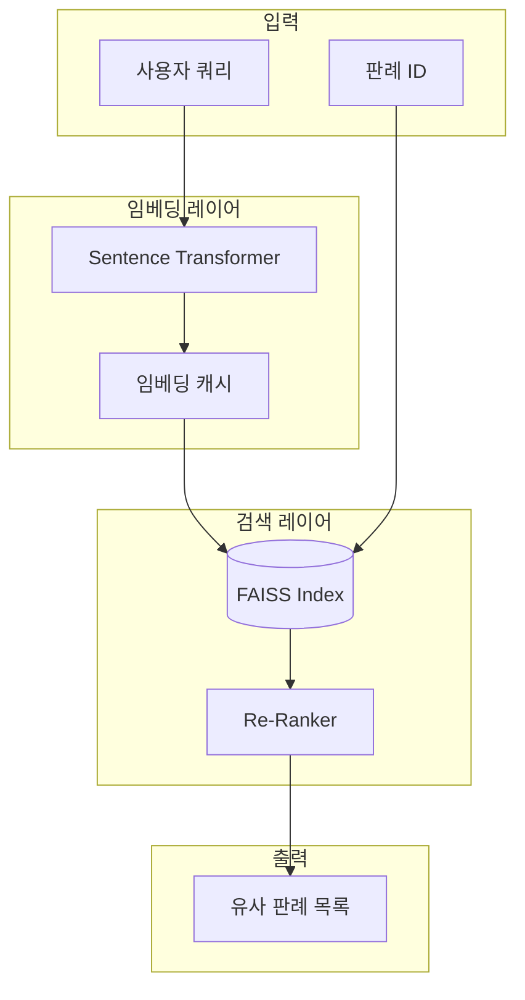

# 유사도 검색 설계

## 1. 개요

본 문서는 Sentence Transformers와 FAISS를 활용한 의미 기반 유사도 검색 시스템의 상세 설계입니다.

---

## 2. 시스템 아키텍처



---

## 3. 임베딩 모델 설계

### 3.1 모델 선택

| 항목 | 값 |
|------|-----|
| 모델명 | `jhgan/ko-sroberta-multitask` |
| 출력 차원 | 768 |
| 최대 토큰 | 512 |
| 언어 | 한국어 |
| 라이선스 | MIT |

### 3.2 모델 선택 이유

1. **한국어 특화**: 한국어 법률 문서에 최적화
2. **무료 사용**: 상업적 이용 가능
3. **검증된 성능**: KorSTS, KorNLI 벤치마크 우수
4. **적절한 크기**: CPU 환경에서도 실행 가능

### 3.3 임베딩 서비스 구현

```python
# app/services/embedding_service.py

import numpy as np
from sentence_transformers import SentenceTransformer
from typing import List, Optional, Union
from functools import lru_cache
import logging

logger = logging.getLogger(__name__)

class EmbeddingService:
    """임베딩 생성 서비스"""
    
    _instance: Optional['EmbeddingService'] = None
    
    def __new__(cls):
        if cls._instance is None:
            cls._instance = super().__new__(cls)
            cls._instance._initialized = False
        return cls._instance
    
    def __init__(
        self,
        model_name: str = "jhgan/ko-sroberta-multitask",
        max_length: int = 512,
        cache_size: int = 10000
    ):
        if self._initialized:
            return
        
        self.model_name = model_name
        self.max_length = max_length
        self.cache_size = cache_size
        
        self.model: Optional[SentenceTransformer] = None
        self._embedding_cache: dict = {}
        
        self._initialized = True
    
    def load_model(self) -> None:
        """모델 로드 (Lazy Loading)"""
        if self.model is None:
            logger.info(f"Loading embedding model: {self.model_name}")
            self.model = SentenceTransformer(self.model_name)
            # CPU 최적화
            self.model.max_seq_length = self.max_length
            logger.info("Model loaded successfully")
    
    def encode(
        self,
        text: Union[str, List[str]],
        normalize: bool = True,
        show_progress: bool = False
    ) -> np.ndarray:
        """텍스트 임베딩 생성"""
        self.load_model()
        
        # 텍스트 전처리
        if isinstance(text, str):
            text = self._preprocess_text(text)
            texts = [text]
        else:
            texts = [self._preprocess_text(t) for t in text]
        
        # 임베딩 생성
        embeddings = self.model.encode(
            texts,
            normalize_embeddings=normalize,
            show_progress_bar=show_progress,
            convert_to_numpy=True
        )
        
        return embeddings.astype('float32')
    
    def encode_cached(self, text: str) -> np.ndarray:
        """캐시된 임베딩 반환"""
        # 캐시 키 생성
        cache_key = hash(text)
        
        if cache_key in self._embedding_cache:
            return self._embedding_cache[cache_key]
        
        embedding = self.encode(text)
        
        # 캐시 크기 관리
        if len(self._embedding_cache) >= self.cache_size:
            # LRU: 가장 오래된 항목 제거
            oldest_key = next(iter(self._embedding_cache))
            del self._embedding_cache[oldest_key]
        
        self._embedding_cache[cache_key] = embedding
        return embedding
    
    def _preprocess_text(self, text: str) -> str:
        """텍스트 전처리"""
        if not text:
            return ""
        
        # 공백 정규화
        import re
        text = re.sub(r'\s+', ' ', text.strip())
        
        # 길이 제한 (토큰 수가 아닌 문자 수로 근사)
        # 평균 1 토큰 ≈ 2-3 한글 문자
        max_chars = self.max_length * 3
        if len(text) > max_chars:
            text = text[:max_chars]
        
        return text
    
    @property
    def dimension(self) -> int:
        """임베딩 차원"""
        return 768

# 싱글톤 인스턴스
embedding_service = EmbeddingService()
```

---

## 4. FAISS 인덱스 설계

### 4.1 인덱스 타입 선택

| 인덱스 타입 | 장점 | 단점 | 선택 |
|------------|------|------|------|
| **IndexFlatL2** | 정확도 100% | 검색 속도 O(n) | ✅ 초기 선택 |
| IndexIVF | 빠른 검색 | 근사 검색 | 대규모시 고려 |
| IndexHNSW | 매우 빠름 | 메모리 사용↑ | 향후 고려 |

### 4.2 인덱스 서비스 구현

```python
# app/services/faiss_service.py

import faiss
import numpy as np
from pathlib import Path
from typing import List, Tuple, Optional, Dict
import json
import logging
from threading import Lock

logger = logging.getLogger(__name__)

class FAISSService:
    """FAISS 벡터 검색 서비스"""
    
    def __init__(
        self,
        index_path: str = "./data/faiss/index.faiss",
        mapping_path: str = "./data/faiss/id_mapping.json",
        dimension: int = 768
    ):
        self.index_path = Path(index_path)
        self.mapping_path = Path(mapping_path)
        self.dimension = dimension
        
        self.index: Optional[faiss.Index] = None
        self.id_mapping: Dict[int, int] = {}  # faiss_id -> case_id
        self.reverse_mapping: Dict[int, int] = {}  # case_id -> faiss_id
        
        self._lock = Lock()
    
    def load_index(self) -> bool:
        """인덱스 로드"""
        if not self.index_path.exists():
            logger.warning(f"Index not found: {self.index_path}")
            return False
        
        with self._lock:
            self.index = faiss.read_index(str(self.index_path))
            
            if self.mapping_path.exists():
                with open(self.mapping_path, 'r') as f:
                    raw_mapping = json.load(f)
                    self.id_mapping = {int(k): v for k, v in raw_mapping.items()}
                    self.reverse_mapping = {v: int(k) for k, v in raw_mapping.items()}
            
            logger.info(f"Index loaded: {self.index.ntotal} vectors")
            return True
    
    def search(
        self,
        query_vector: np.ndarray,
        k: int = 10,
        threshold: Optional[float] = None
    ) -> List[Tuple[int, float]]:
        """
        유사 벡터 검색
        
        Args:
            query_vector: 쿼리 임베딩 (1, 768)
            k: 반환할 결과 수
            threshold: 유사도 임계값 (L2 거리)
        
        Returns:
            List[(case_id, distance)]
        """
        if self.index is None:
            self.load_index()
        
        if self.index is None or self.index.ntotal == 0:
            return []
        
        # 쿼리 벡터 shape 확인
        if query_vector.ndim == 1:
            query_vector = query_vector.reshape(1, -1)
        
        # 검색 실행
        distances, indices = self.index.search(query_vector, k)
        
        # 결과 변환
        results = []
        for i, (faiss_id, distance) in enumerate(zip(indices[0], distances[0])):
            if faiss_id == -1:  # 결과 없음
                continue
            
            # 임계값 필터링
            if threshold is not None and distance > threshold:
                continue
            
            case_id = self.id_mapping.get(faiss_id)
            if case_id:
                results.append((case_id, float(distance)))
        
        return results
    
    def search_similar_to_case(
        self,
        case_id: int,
        k: int = 10,
        exclude_self: bool = True
    ) -> List[Tuple[int, float]]:
        """특정 판례와 유사한 판례 검색"""
        if self.index is None:
            self.load_index()
        
        faiss_id = self.reverse_mapping.get(case_id)
        if faiss_id is None:
            logger.warning(f"Case not in index: {case_id}")
            return []
        
        # 해당 판례의 벡터 가져오기
        vector = self.index.reconstruct(faiss_id)
        
        # k+1개 검색 (자기 자신 제외 시)
        search_k = k + 1 if exclude_self else k
        results = self.search(vector, k=search_k)
        
        # 자기 자신 제외
        if exclude_self:
            results = [(cid, dist) for cid, dist in results if cid != case_id][:k]
        
        return results
    
    def get_vector(self, case_id: int) -> Optional[np.ndarray]:
        """특정 판례의 벡터 조회"""
        if self.index is None:
            self.load_index()
        
        faiss_id = self.reverse_mapping.get(case_id)
        if faiss_id is None:
            return None
        
        return self.index.reconstruct(faiss_id)
    
    def add_vector(self, case_id: int, vector: np.ndarray) -> int:
        """벡터 추가"""
        with self._lock:
            if self.index is None:
                self.index = faiss.IndexFlatL2(self.dimension)
            
            if vector.ndim == 1:
                vector = vector.reshape(1, -1)
            
            faiss_id = self.index.ntotal
            self.index.add(vector)
            
            self.id_mapping[faiss_id] = case_id
            self.reverse_mapping[case_id] = faiss_id
            
            return faiss_id
    
    def save_index(self) -> None:
        """인덱스 저장"""
        with self._lock:
            self.index_path.parent.mkdir(parents=True, exist_ok=True)
            
            faiss.write_index(self.index, str(self.index_path))
            
            with open(self.mapping_path, 'w') as f:
                json.dump(self.id_mapping, f)
            
            logger.info(f"Index saved: {self.index.ntotal} vectors")
    
    def get_stats(self) -> dict:
        """인덱스 통계"""
        return {
            "total_vectors": self.index.ntotal if self.index else 0,
            "dimension": self.dimension,
            "index_type": "IndexFlatL2",
            "index_size_mb": self.index_path.stat().st_size / 1024 / 1024 if self.index_path.exists() else 0
        }

# 싱글톤 인스턴스
faiss_service = FAISSService()
```

---

## 5. 유사도 검색 서비스

### 5.1 통합 검색 서비스

```python
# app/services/similarity_service.py

from typing import List, Optional, Dict, Any
from sqlalchemy.orm import Session
import logging

from app.services.embedding_service import embedding_service
from app.services.faiss_service import faiss_service
from app.models.case import Case
from app.schemas.search import SimilarCaseResult, SemanticSearchResult

logger = logging.getLogger(__name__)

class SimilarityService:
    """유사도 검색 서비스"""
    
    def __init__(self, db: Session):
        self.db = db
    
    def search_by_text(
        self,
        query: str,
        limit: int = 10,
        threshold: Optional[float] = None,
        filters: Optional[Dict[str, Any]] = None
    ) -> List[SemanticSearchResult]:
        """
        자연어 쿼리로 유사 판례 검색
        
        Args:
            query: 검색 쿼리 (자연어)
            limit: 반환 결과 수
            threshold: L2 거리 임계값 (작을수록 유사)
            filters: 추가 필터 (court_id, case_type_id 등)
        """
        logger.info(f"Semantic search: {query[:50]}...")
        
        # 1. 쿼리 임베딩 생성
        query_embedding = embedding_service.encode_cached(query)
        
        # 2. FAISS 검색
        raw_results = faiss_service.search(
            query_embedding,
            k=limit * 2,  # 필터링 후 결과 확보
            threshold=threshold
        )
        
        if not raw_results:
            return []
        
        # 3. 판례 정보 조회
        case_ids = [case_id for case_id, _ in raw_results]
        cases = self.db.query(Case).filter(Case.id.in_(case_ids)).all()
        case_map = {c.id: c for c in cases}
        
        # 4. 필터 적용 및 결과 생성
        results = []
        for case_id, distance in raw_results:
            case = case_map.get(case_id)
            if not case:
                continue
            
            # 필터 적용
            if filters:
                if filters.get("court_id") and case.court_id != filters["court_id"]:
                    continue
                if filters.get("case_type_id") and case.case_type_id != filters["case_type_id"]:
                    continue
                if filters.get("from_date") and case.decision_date < filters["from_date"]:
                    continue
                if filters.get("to_date") and case.decision_date > filters["to_date"]:
                    continue
            
            # 거리를 유사도 점수로 변환 (0-1)
            # L2 거리가 0에 가까울수록 유사
            similarity_score = 1 / (1 + distance)
            
            results.append(SemanticSearchResult(
                case_id=case.id,
                serial_number=case.serial_number,
                case_name=case.case_name,
                case_number=case.case_number,
                decision_date=case.decision_date,
                court_name=case.court.name if case.court else None,
                summary=case.summary,
                similarity_score=round(similarity_score, 4),
                distance=round(distance, 4)
            ))
            
            if len(results) >= limit:
                break
        
        return results
    
    def find_similar_cases(
        self,
        case_id: int,
        limit: int = 10,
        filters: Optional[Dict[str, Any]] = None
    ) -> List[SimilarCaseResult]:
        """
        특정 판례와 유사한 판례 검색
        
        Args:
            case_id: 기준 판례 ID
            limit: 반환 결과 수
            filters: 추가 필터
        """
        logger.info(f"Finding similar cases for: {case_id}")
        
        # 1. FAISS에서 유사 판례 검색
        raw_results = faiss_service.search_similar_to_case(
            case_id,
            k=limit * 2,
            exclude_self=True
        )
        
        if not raw_results:
            return []
        
        # 2. 판례 정보 조회
        similar_ids = [cid for cid, _ in raw_results]
        cases = self.db.query(Case).filter(Case.id.in_(similar_ids)).all()
        case_map = {c.id: c for c in cases}
        
        # 3. 결과 생성
        results = []
        for similar_id, distance in raw_results:
            case = case_map.get(similar_id)
            if not case:
                continue
            
            # 필터 적용
            if filters:
                if filters.get("court_id") and case.court_id != filters["court_id"]:
                    continue
                if filters.get("case_type_id") and case.case_type_id != filters["case_type_id"]:
                    continue
            
            similarity_score = 1 / (1 + distance)
            
            results.append(SimilarCaseResult(
                case_id=case.id,
                serial_number=case.serial_number,
                case_name=case.case_name,
                case_number=case.case_number,
                decision_date=case.decision_date,
                court_name=case.court.name if case.court else None,
                summary=case.summary[:200] + "..." if case.summary and len(case.summary) > 200 else case.summary,
                similarity_score=round(similarity_score, 4)
            ))
            
            if len(results) >= limit:
                break
        
        return results
    
    def compute_similarity(self, case_id_1: int, case_id_2: int) -> Optional[float]:
        """
        두 판례 간 유사도 계산
        
        Returns:
            유사도 점수 (0-1, 1이 완전 동일)
        """
        vec1 = faiss_service.get_vector(case_id_1)
        vec2 = faiss_service.get_vector(case_id_2)
        
        if vec1 is None or vec2 is None:
            return None
        
        # L2 거리 계산
        import numpy as np
        distance = float(np.linalg.norm(vec1 - vec2))
        
        # 유사도로 변환
        similarity = 1 / (1 + distance)
        return round(similarity, 4)
```

---

## 6. 검색 품질 향상

### 6.1 Re-Ranking 모듈

```python
# app/services/reranker.py

from typing import List, Tuple
from sqlalchemy.orm import Session

class ReRanker:
    """검색 결과 재순위화"""
    
    def __init__(self, db: Session):
        self.db = db
    
    def rerank(
        self,
        results: List[Tuple[int, float]],
        query: str,
        boost_factors: dict = None
    ) -> List[Tuple[int, float]]:
        """
        검색 결과 재순위화
        
        Boost Factors:
        - same_court: 같은 법원이면 점수 boost
        - recent: 최신 판례일수록 boost
        - case_type_match: 같은 사건유형이면 boost
        """
        if not boost_factors:
            return results
        
        reranked = []
        for case_id, base_score in results:
            final_score = base_score
            
            # 부스트 적용 로직...
            # (DB 조회 필요 시 배치로 처리)
            
            reranked.append((case_id, final_score))
        
        # 점수 기준 재정렬
        reranked.sort(key=lambda x: x[1], reverse=True)
        return reranked
```

### 6.2 하이브리드 검색

```python
# app/services/hybrid_search.py

from typing import List, Dict, Any
from sqlalchemy.orm import Session
from sqlalchemy import or_

from app.models.case import Case
from app.services.similarity_service import SimilarityService

class HybridSearchService:
    """하이브리드 검색 (키워드 + 시맨틱)"""
    
    def __init__(self, db: Session):
        self.db = db
        self.similarity_service = SimilarityService(db)
    
    def search(
        self,
        query: str,
        limit: int = 10,
        keyword_weight: float = 0.3,
        semantic_weight: float = 0.7,
        filters: Dict[str, Any] = None
    ) -> List[Dict[str, Any]]:
        """
        하이브리드 검색
        
        1. 키워드 검색 (PostgreSQL full-text)
        2. 시맨틱 검색 (FAISS)
        3. 점수 결합
        """
        # 1. 키워드 검색
        keyword_results = self._keyword_search(query, limit * 2, filters)
        
        # 2. 시맨틱 검색
        semantic_results = self.similarity_service.search_by_text(
            query, limit * 2, filters=filters
        )
        
        # 3. 점수 결합
        combined = self._combine_scores(
            keyword_results,
            semantic_results,
            keyword_weight,
            semantic_weight
        )
        
        return combined[:limit]
    
    def _keyword_search(
        self,
        query: str,
        limit: int,
        filters: Dict[str, Any] = None
    ) -> List[Dict[str, Any]]:
        """키워드 기반 검색"""
        # PostgreSQL LIKE 검색 (추후 full-text search로 개선)
        base_query = self.db.query(Case)
        
        # 키워드 필터
        keywords = query.split()
        keyword_filters = [
            or_(
                Case.case_name.ilike(f"%{kw}%"),
                Case.summary.ilike(f"%{kw}%"),
                Case.holding.ilike(f"%{kw}%")
            )
            for kw in keywords
        ]
        
        if keyword_filters:
            base_query = base_query.filter(or_(*keyword_filters))
        
        # 추가 필터
        if filters:
            if filters.get("court_id"):
                base_query = base_query.filter(Case.court_id == filters["court_id"])
            if filters.get("case_type_id"):
                base_query = base_query.filter(Case.case_type_id == filters["case_type_id"])
        
        cases = base_query.limit(limit).all()
        
        # 키워드 매칭 점수 계산
        results = []
        for case in cases:
            score = self._calculate_keyword_score(query, case)
            results.append({
                "case_id": case.id,
                "score": score,
                "case": case
            })
        
        return sorted(results, key=lambda x: x["score"], reverse=True)
    
    def _calculate_keyword_score(self, query: str, case: Case) -> float:
        """키워드 매칭 점수"""
        keywords = query.lower().split()
        score = 0.0
        
        text_fields = [
            (case.case_name or "", 3.0),  # 사건명 가중치 높음
            (case.summary or "", 2.0),
            (case.holding or "", 2.0),
            (case.full_text or "", 1.0),
        ]
        
        for text, weight in text_fields:
            text_lower = text.lower()
            for kw in keywords:
                if kw in text_lower:
                    score += weight
        
        return score
    
    def _combine_scores(
        self,
        keyword_results: List[Dict],
        semantic_results: List,
        kw_weight: float,
        sem_weight: float
    ) -> List[Dict[str, Any]]:
        """점수 결합"""
        # 정규화를 위한 최대값
        max_kw = max((r["score"] for r in keyword_results), default=1.0) or 1.0
        max_sem = max((r.similarity_score for r in semantic_results), default=1.0) or 1.0
        
        combined = {}
        
        # 키워드 검색 결과
        for r in keyword_results:
            case_id = r["case_id"]
            norm_score = (r["score"] / max_kw) * kw_weight
            combined[case_id] = {
                "case_id": case_id,
                "case": r["case"],
                "keyword_score": r["score"],
                "semantic_score": 0.0,
                "combined_score": norm_score
            }
        
        # 시맨틱 검색 결과
        for r in semantic_results:
            case_id = r.case_id
            norm_score = (r.similarity_score / max_sem) * sem_weight
            
            if case_id in combined:
                combined[case_id]["semantic_score"] = r.similarity_score
                combined[case_id]["combined_score"] += norm_score
            else:
                combined[case_id] = {
                    "case_id": case_id,
                    "case": None,  # DB 조회 필요
                    "keyword_score": 0.0,
                    "semantic_score": r.similarity_score,
                    "combined_score": norm_score
                }
        
        # 정렬
        sorted_results = sorted(
            combined.values(),
            key=lambda x: x["combined_score"],
            reverse=True
        )
        
        return sorted_results
```

---

## 7. 임베딩 최적화

### 7.1 텍스트 전처리 전략

```python
# app/services/text_preprocessor.py

import re
from typing import Optional

class LegalTextPreprocessor:
    """법률 문서 전처리기"""
    
    @staticmethod
    def preprocess_for_embedding(
        case_name: str = "",
        summary: str = "",
        holding: str = "",
        max_length: int = 1024
    ) -> str:
        """임베딩용 텍스트 생성"""
        
        # 중요도 순서로 텍스트 결합
        parts = []
        
        # 1. 사건명 (가장 중요)
        if case_name:
            parts.append(f"[사건] {case_name}")
        
        # 2. 판시사항 (핵심 법리)
        if holding:
            cleaned_holding = LegalTextPreprocessor._clean_text(holding)
            parts.append(f"[판시] {cleaned_holding[:400]}")
        
        # 3. 판결요지
        if summary:
            cleaned_summary = LegalTextPreprocessor._clean_text(summary)
            parts.append(f"[요지] {cleaned_summary[:500]}")
        
        combined = " ".join(parts)
        
        # 최대 길이 제한
        if len(combined) > max_length:
            combined = combined[:max_length]
        
        return combined
    
    @staticmethod
    def _clean_text(text: str) -> str:
        """텍스트 정제"""
        if not text:
            return ""
        
        # 특수문자 정리
        text = re.sub(r'[\x00-\x1f\x7f-\x9f]', '', text)
        
        # 괄호 내용 간소화
        text = re.sub(r'\([^)]{50,}\)', '(...)', text)
        
        # 연속 공백 정리
        text = re.sub(r'\s+', ' ', text)
        
        # 법조문 참조 간소화
        text = re.sub(r'제\d+조(?:의\d+)?(?:\s*제\d+항)?(?:\s*제\d+호)?', '[조문]', text)
        
        return text.strip()
```

### 7.2 배치 임베딩 생성

```python
# app/services/batch_embedding.py

import numpy as np
from typing import List, Tuple
from sqlalchemy.orm import Session
import logging

from app.models.case import Case
from app.services.embedding_service import embedding_service
from app.services.faiss_service import faiss_service
from app.services.text_preprocessor import LegalTextPreprocessor

logger = logging.getLogger(__name__)

class BatchEmbeddingService:
    """배치 임베딩 생성 서비스"""
    
    def __init__(self, db: Session):
        self.db = db
    
    def generate_all_embeddings(self, batch_size: int = 100):
        """전체 판례 임베딩 생성"""
        
        # 임베딩 없는 판례 조회
        cases = self.db.query(Case).all()
        total = len(cases)
        
        logger.info(f"Generating embeddings for {total} cases")
        
        case_embeddings: List[Tuple[int, np.ndarray]] = []
        
        for i in range(0, total, batch_size):
            batch = cases[i:i + batch_size]
            
            # 텍스트 전처리
            texts = [
                LegalTextPreprocessor.preprocess_for_embedding(
                    case_name=c.case_name,
                    summary=c.summary,
                    holding=c.holding
                )
                for c in batch
            ]
            
            # 배치 임베딩 생성
            embeddings = embedding_service.encode(texts, show_progress=False)
            
            for case, embedding in zip(batch, embeddings):
                case_embeddings.append((case.id, embedding))
            
            logger.info(f"Progress: {i + len(batch)}/{total}")
        
        # FAISS 인덱스 빌드
        logger.info("Building FAISS index...")
        
        for case_id, embedding in case_embeddings:
            faiss_service.add_vector(case_id, embedding)
        
        faiss_service.save_index()
        
        logger.info(f"Completed: {len(case_embeddings)} embeddings generated")
        
        return len(case_embeddings)
```

---

## 8. 성능 최적화

### 8.1 메모리 관리

```python
# 임베딩 모델 메모리 최적화
class EmbeddingService:
    def unload_model(self):
        """모델 언로드 (메모리 해제)"""
        if self.model is not None:
            del self.model
            self.model = None
            import gc
            gc.collect()
            logger.info("Model unloaded")
```

### 8.2 검색 캐싱

```python
# app/services/search_cache.py

from functools import lru_cache
from typing import Tuple
import hashlib

class SearchCache:
    """검색 결과 캐싱"""
    
    def __init__(self, max_size: int = 1000):
        self._cache = {}
        self.max_size = max_size
    
    def _make_key(self, query: str, **kwargs) -> str:
        """캐시 키 생성"""
        key_data = f"{query}:{sorted(kwargs.items())}"
        return hashlib.md5(key_data.encode()).hexdigest()
    
    def get(self, query: str, **kwargs):
        """캐시 조회"""
        key = self._make_key(query, **kwargs)
        return self._cache.get(key)
    
    def set(self, query: str, result, **kwargs):
        """캐시 저장"""
        if len(self._cache) >= self.max_size:
            # LRU: 가장 오래된 항목 제거
            oldest = next(iter(self._cache))
            del self._cache[oldest]
        
        key = self._make_key(query, **kwargs)
        self._cache[key] = result
    
    def clear(self):
        """캐시 초기화"""
        self._cache.clear()

search_cache = SearchCache()
```

---

## 9. 모니터링 메트릭

### 9.1 검색 품질 메트릭

| 메트릭 | 설명 | 목표값 |
|--------|------|--------|
| 평균 검색 시간 | FAISS 검색 + 후처리 | < 200ms |
| 임베딩 생성 시간 | 단일 쿼리 임베딩 | < 50ms |
| 인덱스 메모리 | FAISS 인덱스 크기 | < 2GB |
| 캐시 적중률 | 검색 캐시 hit rate | > 30% |

### 9.2 메트릭 수집

```python
# app/services/metrics.py

import time
from functools import wraps
import logging

logger = logging.getLogger(__name__)

def measure_time(func):
    """실행 시간 측정 데코레이터"""
    @wraps(func)
    async def wrapper(*args, **kwargs):
        start = time.time()
        result = await func(*args, **kwargs)
        elapsed = (time.time() - start) * 1000
        
        logger.info(f"{func.__name__} took {elapsed:.2f}ms")
        return result
    
    return wrapper
```

---

## 10. API 엔드포인트

### 10.1 라우터 구현

```python
# app/api/v1/endpoints/search.py

from fastapi import APIRouter, Depends, Query
from sqlalchemy.orm import Session
from typing import List, Optional

from app.database import get_db
from app.services.similarity_service import SimilarityService
from app.schemas.search import (
    SemanticSearchRequest,
    SemanticSearchResponse,
    SimilarCaseRequest,
    SimilarCaseResponse
)

router = APIRouter()

@router.post("/semantic", response_model=SemanticSearchResponse)
async def semantic_search(
    request: SemanticSearchRequest,
    db: Session = Depends(get_db)
):
    """
    자연어 시맨틱 검색
    
    사용자의 자연어 쿼리를 임베딩으로 변환하여
    의미적으로 유사한 판례를 검색합니다.
    """
    service = SimilarityService(db)
    
    results = service.search_by_text(
        query=request.query,
        limit=request.limit,
        threshold=request.threshold,
        filters=request.filters.dict() if request.filters else None
    )
    
    return SemanticSearchResponse(
        query=request.query,
        total=len(results),
        results=results
    )

@router.get("/cases/{case_id}/similar", response_model=SimilarCaseResponse)
async def get_similar_cases(
    case_id: int,
    limit: int = Query(10, ge=1, le=50),
    db: Session = Depends(get_db)
):
    """
    유사 판례 조회
    
    특정 판례와 의미적으로 유사한 판례 목록을 반환합니다.
    """
    service = SimilarityService(db)
    
    results = service.find_similar_cases(
        case_id=case_id,
        limit=limit
    )
    
    return SimilarCaseResponse(
        case_id=case_id,
        total=len(results),
        similar_cases=results
    )
```
